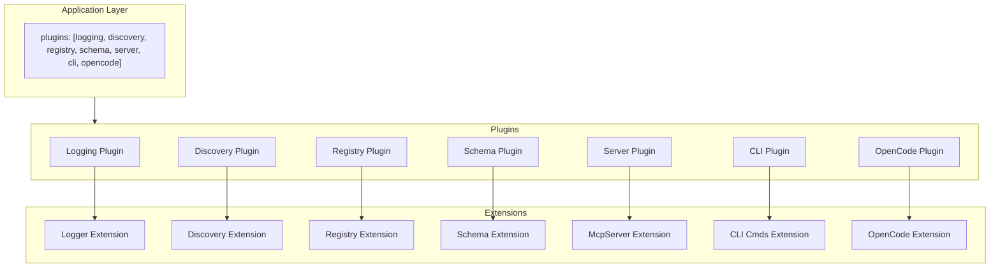
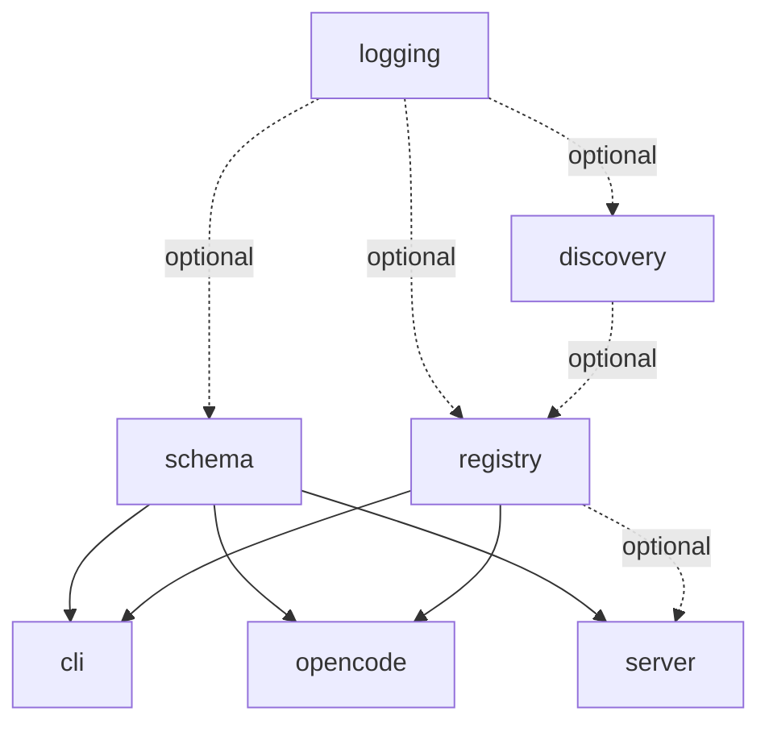

# gunshi-mcp Library Design

## Vision

Define a tool once with `defineTool()`, expose it everywhere - MCP server, CLI commands, OpenCode - via composable gunshi plugins.

gunshi-mcp is a toolkit for building tools. You're building a CLI application. Your application does things - it fetches data, transforms files, deploys infrastructure, manages resources. These capabilities are _tools_. gunshi-mcp helps you define these tools once and expose them through multiple interfaces: as CLI commands your users type, as MCP tools that AI assistants can invoke, as OpenCode custom tools for agentic workflows.

One definition. Multiple surfaces. No duplication.

### The Problem

Modern developer tools need to be accessible in multiple ways. A user might invoke your tool from their terminal. An AI coding assistant might invoke the same tool through MCP. An autonomous agent in OpenCode might need that same capability. Today, you'd write the same logic three times with three different APIs, three different schemas, three different ways of handling arguments and producing output.

### What gunshi-mcp Provides

gunshi-mcp is a library for people who are _making_ tools - not using them. It's infrastructure for tool authors.

You describe your tool's purpose, its inputs (via Zod schemas), and its behavior (a handler function). gunshi-mcp takes that single definition and makes it available wherever it needs to be:

- **CLI**: Your tool becomes a command with flags, help text, and argument validation - all derived from your schema
- **MCP Server**: Your tool is exposed via the Model Context Protocol, ready for Claude, Cursor, or any MCP client
- **OpenCode**: Your tool integrates with opencode's custom tool system for agentic automation

The key insight is that these are all the same tool. The interface differs, but the capability is identical. gunshi-mcp bridges that gap.

### How It Works

gunshi-mcp builds on [gunshi](https://github.com/kazupon/gunshi), a modern CLI framework with a powerful plugin system. Each capability - discovery, registration, server management, CLI generation, OpenCode integration - is its own gunshi plugin with a focused responsibility.

You compose these plugins to match your needs:

```typescript
import { cli } from "gunshi"
import {
  createDiscoveryPlugin,
  createRegistryPlugin,
  createServerPlugin,
  createCliPlugin
} from "gunshi-mcp"

await cli(args, command, {
  plugins: [
    createDiscoveryPlugin({ patterns: ["tools/**/*.ts"] }),
    createRegistryPlugin({ autoDiscover: true }),
    createServerPlugin({ name: "my-app" }),
    createCliPlugin(),
  ],
})
```

Need MCP but not CLI? Omit the CLI plugin. Need CLI but not MCP? Omit the server plugin. The plugins are independent, composable building blocks.

---

## Plugin Architecture

gunshi-mcp decomposes into focused plugins, each with a single responsibility and a typed extension. Plugins can be used independently or combined.

### Plugin Inventory

```
┌───────────────────────────────────────────────────────────────────────────────┐
│                             Application Layer                                  │
│   plugins: [logging, discovery, registry, schema, server, cli, opencode]      │
└───────────────────────────────────────────────────────────────────────────────┘
                                          │
      ┌──────────┬──────────┬─────────────┼─────────────┬──────────┬──────────┐
      ▼          ▼          ▼             ▼             ▼          ▼          ▼
  ┌────────┐ ┌────────┐ ┌────────┐   ┌────────┐   ┌────────┐ ┌────────┐
  │Logging │ │Discovery│ │Registry│   │ Server │   │  CLI   │ │OpenCode│
  │ Plugin │ │ Plugin │ │ Plugin │   │ Plugin │   │ Plugin │ │ Plugin │
  └────────┘ └────────┘ └────────┘   └────────┘   └────────┘ └────────┘
      │          │          │             │             │          │
      ▼          ▼          ▼             ▼             ▼          ▼
   Logger    Discovery   Registry     McpServer     CLI Cmds  OpenCode
  Extension  Extension  Extension    Extension     Extension  Extension
```



---

## Schema Plugin: The Foundation

### Problem Statement

gunshi-mcp converts Zod schemas into multiple output formats:

- **Gunshi CLI arguments** - flags with types, descriptions, defaults
- **MCP tool schemas** - the `@modelcontextprotocol/server` library accepts either Zod schemas or JSON Schema directly; we prefer passing raw Zod
- **OpenCode tool definitions** - schema format TBD

The Zod introspection, flattening, and schema analysis capabilities serve all consumers. Rather than each plugin (CLI, Server, OpenCode) reimplementing Zod introspection, we create a **Schema Plugin** that provides shared Zod analysis infrastructure.

### Schema Plugin: Shared Infrastructure for Zod Analysis

The core insight is that Zod schema analysis is _infrastructure_, not an implementation detail of any single plugin. When you define a tool with a Zod schema, multiple consumers need to understand that schema:

- **CLI** needs to flatten nested objects into flags, handle arrays, generate help text
- **MCP Server** needs JSON Schema representation with proper types and descriptions
- **OpenCode** needs whatever schema format it requires (likely similar to MCP)

Rather than each plugin reimplementing Zod introspection, we create a **Schema Plugin** that:

1. Provides a `SchemaExtension` with methods to analyze Zod schemas
2. Exposes pipeline primitives: introspect, flatten, validate
3. Caches analysis results (a schema analyzed once doesn't need re-analysis)
4. Offers extension points for custom type handling

Each consumer plugin then depends on the Schema Plugin and builds its own pipeline on top of the shared foundation. The CLI plugin has a `cli/schema/` directory for CLI-specific transformations (ZodFieldInfo → GunshiArg). The Server plugin has `server/schema/` for MCP-specific transformations (ZodFieldInfo → JSON Schema).

The pipeline concept becomes explicit and user-facing. A tool author can understand:

```
Zod Schema
    ↓ [schema plugin: introspect]
ZodFieldInfo[]
    ↓ [schema plugin: flatten]
FlattenedField[]
    ↓ [cli plugin: toGunshiArgs]         ↓ [server plugin: pass-through]
GunshiArg[]                           Zod Schema (unchanged)
    ↓ [cli plugin: toCommand]            ↓ [server plugin: registerTool]
Gunshi Command                        MCP Tool
```

Note: The MCP server path is simpler because `@modelcontextprotocol/server` accepts Zod schemas directly. The schema plugin's introspect/flatten is primarily for CLI, but remains available for other consumers that need structured field information.

This makes the system understandable: there's a shared analysis phase, then consumer-specific output phases. Users who want to customize can intervene at any stage.

### Schema Plugin Structure

```
src/
├── schema/                       # Schema Plugin - shared Zod analysis
│   ├── introspect/
│   │   ├── field.ts              # Extract ZodFieldInfo from a field
│   │   ├── unwrap.ts             # Unwrap optionals, defaults, etc.
│   │   └── types.ts              # Introspection result types
│   │
│   ├── flatten/
│   │   ├── flatten.ts            # Nested schema → flat fields
│   │   ├── collision.ts          # Detect/report collisions
│   │   └── types.ts              # FlattenContext, FlattenOptions
│   │
│   ├── validate/
│   │   ├── required.ts           # Validate required fields present
│   │   └── types.ts              # Validate type compatibility
│   │
│   ├── cache.ts                  # Cache analyzed schemas
│   ├── plugin.ts                 # createSchemaPlugin
│   ├── types.ts                  # SchemaExtension, shared types
│   └── index.ts                  # Re-exports
```

### Schema Plugin Extension

```typescript
export const SCHEMA_PLUGIN_ID = "gunshi-mcp:schema" as const

export interface SchemaExtension {
  /** Introspect a Zod schema, returning field information */
  introspect: <T extends z.ZodRawShape>(schema: z.ZodObject<T>) => ZodFieldInfo[]

  /** Flatten nested schema to flat keys with collision detection */
  flatten: <T extends z.ZodRawShape>(
    schema: z.ZodObject<T>,
    options?: FlattenOptions
  ) => FlattenedField[]

  /** Get cached analysis or compute fresh */
  analyze: <T extends z.ZodRawShape>(
    schema: z.ZodObject<T>,
    options?: AnalyzeOptions
  ) => SchemaAnalysis

  /** Register custom type handler for extension */
  registerTypeHandler: (typeName: string, handler: TypeHandler) => void
}

export interface SchemaAnalysis {
  fields: ZodFieldInfo[]
  flattened: FlattenedField[]
  required: string[]
  hasNested: boolean
  maxDepth: number
}
```

### Pipeline Visualization

The pipeline becomes a first-class concept users can reason about:

```typescript
// Conceptual pipeline (not necessarily literal API)
const cliPipeline = pipeline(
  schemaPlugin.introspect,      // Zod → ZodFieldInfo[]
  schemaPlugin.flatten,         // → FlattenedField[]
  cliPlugin.toGunshiArgs,       // → GunshiArg[]
  cliPlugin.applyOverrides,     // → GunshiArg[] (with user overrides)
)

// MCP pipeline is simpler - pass Zod directly
const mcpPipeline = pipeline(
  (tool) => tool.inputSchema,   // Zod schema pass-through
  serverPlugin.registerTool,    // McpServer accepts Zod directly
)
```

### Why Schema as a Plugin?

The Schema Plugin provides several benefits:

1. **Single source of truth for Zod analysis** - No duplication across plugins
2. **Explicit pipelines** - Users understand the data flow
3. **Testable in isolation** - Each stage can be unit tested
4. **Extensible** - Custom type handlers, alternative flatten strategies
5. **Plugin-native** - Follows gunshi's plugin patterns with typed extensions
6. **Consumer-specific directories** - Each plugin owns its output transformations
7. **Cacheable** - Schema analysis can be cached and reused
8. **Library-friendly** - Schema utilities usable outside gunshi context

---

## Plugin Details

### 1. Logging Plugin

**ID:** `gunshi-mcp:logging`

**Responsibility:** Structured logging with level control

**Factory:** `createLoggingPlugin(options?)`

**Extension:**

```typescript
interface LoggerExtension {
  info: (msg: string, ...args: unknown[]) => void
  warn: (msg: string, ...args: unknown[]) => void
  error: (msg: string, ...args: unknown[]) => void
  debug: (msg: string, ...args: unknown[]) => void
  child: (bindings: Record<string, unknown>) => LoggerExtension
}
```

**Dependencies:** None

**Status:** Implemented in `src/plugins/logger.ts`

---

### 2. Discovery Plugin

**ID:** `gunshi-mcp:discovery`

**Responsibility:** Find and load GunshiTool definitions from filesystem

**Factory:** `createDiscoveryPlugin(options?)`

**Extension:**

```typescript
interface DiscoveryExtension {
  readonly tools: readonly GunshiTool[]
  rediscover: () => Promise<GunshiTool[]>
  hasTool: (name: string) => boolean
  getTool: (name: string) => GunshiTool | undefined
}
```

**Dependencies:** `logging` (optional)

**Options:**

```typescript
interface DiscoveryPluginOptions {
  roots?: RootDiscovery
  tools?: ToolDiscovery
  patterns?: string[]
  strict?: boolean
}
```

**CLI Commands Added:** `tools` - list discovered tools

---

### 3. Registry Plugin

**ID:** `gunshi-mcp:registry`

**Responsibility:** Manage tool collection with add/remove/list operations

**Factory:** `createRegistryPlugin(options?)`

**Extension:**

```typescript
interface RegistryExtension {
  register: (tool: GunshiTool) => void
  unregister: (name: string) => boolean
  list: () => readonly GunshiTool[]
  get: (name: string) => GunshiTool | undefined
  has: (name: string) => boolean
  clear: () => void
  readonly count: number
}
```

**Dependencies:** `discovery` (optional) - auto-registers discovered tools

**Options:**

```typescript
interface RegistryPluginOptions {
  tools?: GunshiTool[]
  autoDiscover?: boolean
  onConflict?: "replace" | "skip" | "error"
}
```

**Why separate from Discovery?**

- Registry manages the canonical tool collection
- Discovery is one source; explicit tools, remote registries are others
- Registry can exist without discovery (explicit tools only)
- Discovery can exist without registry (just find tools, don't manage)

---

### 4. Schema Plugin

**ID:** `gunshi-mcp:schema`

**Responsibility:** Shared Zod schema analysis infrastructure for all consumers

**Factory:** `createSchemaPlugin(options?)`

**Extension:** See Schema Extension definition above

**Dependencies:** `logging` (optional)

**Options:**

```typescript
interface SchemaPluginOptions {
  typeHandlers?: Record<string, TypeHandler>
  cache?: boolean
}
```

**Why Schema as a separate plugin?**

- Provides shared infrastructure for CLI, Server, and OpenCode plugins
- Eliminates duplication of Zod introspection logic
- Caches schema analysis results for performance
- Offers extension points for custom type handling
- Follows the single responsibility principle

---

### 5. Server Plugin

**ID:** `gunshi-mcp:server`

**Responsibility:** Create and manage McpServer lifecycle

**Factory:** `createServerPlugin(options?)`

**Extension:**

```typescript
interface ServerExtension {
  readonly server: McpServer
  readonly isRunning: boolean
  start: (transport?: Transport) => Promise<void>
  stop: () => Promise<void>
  registerTool: (tool: GunshiTool) => void
  registerPrompt: (prompt: McpPrompt) => void
  registerResource: (resource: McpResource) => void
}
```

**Dependencies:** `logging` (optional), `registry` (optional), `schema` (required)

**Options:**

```typescript
interface ServerPluginOptions {
  name?: string
  version?: string
  capabilities?: Capabilities
  transport?: "stdio" | "sse" | Transport
  autoRegister?: boolean
}
```

---

### 6. CLI Plugin

**ID:** `gunshi-mcp:cli`

**Responsibility:** Generate gunshi CLI commands from tools

**Factory:** `createCliPlugin(options?)`

**Extension:**

```typescript
interface CliExtension {
  readonly commands: readonly string[]
  refresh: () => void
}
```

**Dependencies:** `registry`, `schema`

**Options:**

```typescript
interface CliPluginOptions {
  prefix?: string
  separator?: string
  formatFlag?: boolean
}
```

**Behavior:**

- During `onExtension`, reads tools from registry (extensions not available in setup)
- Calls `ctx.addCommand()` for each tool
- Uses schema plugin's `flatten` for arg conversion

---

### 7. OpenCode Plugin

**ID:** `gunshi-mcp:opencode`

**Ticket:** gunshi-mcp-47k

**Responsibility:** Expose GunshiTools as opencode custom tools

**Factory:** `createOpenCodePlugin(options?)`

**Extension:**

```typescript
interface OpenCodeExtension {
  readonly isOpenCodeEnvironment: boolean
  readonly exposedTools: readonly string[]
  expose: (tool: GunshiTool) => void
}
```

**Dependencies:** `registry`, `schema`

**Options:**

```typescript
interface OpenCodePluginOptions {
  include?: string[]
  exclude?: string[]
  autoExpose?: boolean
}
```

**Open Question:** Detection of opencode environment

- Need a reliable way to detect we're running inside opencode
- Could be env var, process inspection, or opencode-provided API
- **Not solving now** - note as required capability from opencode

---

## Dependency Graph

```
                    ┌─────────┐
                    │ logging │
                    └────┬────┘
                         │ optional
             ┌────────────┼────────────┐
             ▼            ▼            ▼
       ┌──────────┐ ┌──────────┐ ┌──────────┐
       │ discovery│ │ registry │ │  schema  │
       └────┬─────┘ └────┬─────┘ └────┬─────┘
            │            │            │
            │  optional  │            │ required
            └─────►──────┤            │
                         │       ┌────┴────┐
            ┌────────────┤       │         │
            ▼            ▼       ▼         ▼
       ┌─────────┐  ┌─────────┐ ┌────┐ ┌────────┐
       │   cli   │  │opencode │ │svr │ │ server │
       └─────────┘  └─────────┘ └────┘ └────────┘
```



---

## The Builder

While each plugin has its own factory function, the **builder pattern** provides a convenient way to assemble multiple plugins together. It guides configuration with type safety and handles plugin ordering.

### Builder API

```typescript
import { gunshiMcp } from "gunshi-mcp"

const plugins = gunshiMcp()
  .withLogging({ level: "debug" })
  .withDiscovery({ patterns: ["tools/**/*.ts"] })
  .withRegistry({ autoDiscover: true })
  .withSchema({ typeHandlers: { ... } })
  .withServer({ name: "my-app" })
  .withCli()
  .withOpenCode()
  .build()

await cli(args, command, { plugins })
```

### Builder Methods

| Method                  | Plugin Created          | Dependencies                           |
| ----------------------- | ----------------------- | -------------------------------------- |
| `.withLogging(opts?)`   | `createLoggingPlugin`   | None                                   |
| `.withDiscovery(opts?)` | `createDiscoveryPlugin` | Logging (optional)                     |
| `.withRegistry(opts?)`  | `createRegistryPlugin`  | Discovery (optional)                   |
| `.withSchema(opts?)`    | `createSchemaPlugin`    | Logging (optional)                     |
| `.withServer(opts?)`    | `createServerPlugin`    | Schema (required), Registry (optional) |
| `.withCli(opts?)`       | `createCliPlugin`       | Schema (required), Registry            |
| `.withOpenCode(opts?)`  | `createOpenCodePlugin`  | Schema (required), Registry            |
| `.build()`              | Returns `Plugin[]`      | -                                      |

### Builder Integration with Schema Plugin

Schema is auto-included when CLI, Server, or OpenCode are added. Users don't need to explicitly add it unless they want to configure it.

```typescript
gunshiMcp()
  .withCli()  // Automatically includes schema plugin
  .build()

// Explicit configuration
gunshiMcp()
  .withSchema({ typeHandlers: { ... } })
  .withCli()
  .build()
```

### Builder vs Direct Plugin Composition

The builder is syntactic sugar. These are equivalent:

```typescript
// Using builder
const plugins = gunshiMcp()
  .withDiscovery()
  .withRegistry({ autoDiscover: true })
  .withSchema()
  .withServer()
  .build()

// Using plugin factories directly
const plugins = [
  createDiscoveryPlugin(),
  createRegistryPlugin({ autoDiscover: true }),
  createSchemaPlugin(),
  createServerPlugin(),
]
```

Use the builder for convenience. Use plugin factories directly when you need more control or are integrating with other gunshi plugins.

---

## Usage Patterns

### MCP Server Only (No CLI)

```typescript
const plugins = gunshiMcp()
  .withLogging()
  .withDiscovery()
  .withRegistry({ autoDiscover: true })
  .withSchema()
  .withServer({ name: "my-mcp", version: "1.0.0" })
  .build()
```

### CLI Only (No MCP Server)

```typescript
const plugins = gunshiMcp()
  .withDiscovery({ patterns: ["commands/**/*.ts"] })
  .withRegistry({ autoDiscover: true })
  .withSchema()
  .withCli({ prefix: "tool" })
  .build()
```

### OpenCode + MCP + CLI (Full Stack)

```typescript
const plugins = gunshiMcp()
  .withLogging({ level: "debug" })
  .withDiscovery()
  .withRegistry({ autoDiscover: true })
  .withSchema()
  .withServer()
  .withCli()
  .withOpenCode({ autoExpose: true })
  .build()
```

### Explicit Tools Only (No Discovery)

```typescript
import { myTool, otherTool } from "./tools/index.ts"

const plugins = gunshiMcp()
  .withRegistry({ tools: [myTool, otherTool] })
  .withSchema()
  .withServer()
  .withCli()
  .build()
```

### Custom Discovery Strategy

```typescript
import { chainRoots, defaultRootDiscovery, explicitRoots, globToolDiscovery } from "gunshi-mcp"

const plugins = gunshiMcp()
  .withDiscovery({
    roots: chainRoots(
      defaultRootDiscovery,
      explicitRoots("/shared/tools", "/plugins")
    ),
    tools: globToolDiscovery({
      patterns: ["**/*.tool.ts"],
      ignore: ["**/*.test.ts"],
    }),
  })
  .withRegistry({ autoDiscover: true })
  .withSchema()
  .withServer()
  .build()
```

### Programmatic Server Control

```typescript
// Using plugin factories for more control
const plugins = [
  createRegistryPlugin({ tools: myTools }),
  createSchemaPlugin(),
  createServerPlugin({ autoRegister: false }),
]

const app = await cli(args, command, { plugins })

// Later, programmatically
const server = app.extensions["gunshi-mcp:server"]
server.registerTool(dynamicTool)
await server.start(new SseTransport())
```

---

## File Structure

Each plugin lives in its own directory. The directory contains both a **general-purpose implementation** (not gunshi-specific) and a **plugin wrapper** that composes it into gunshi's plugin system.

This separation means:

- The core logic can be used outside of gunshi
- The plugin is a thin adapter over proven, testable components
- Complex plugins can be broken into multiple files without cramming everything into one

```
src/
├── logging/
│   ├── logger.ts         # Pino logger factory, LoggerExtension interface
│   └── plugin.ts         # createLoggingPlugin - wraps logger for gunshi
│
├── discovery/
│   ├── roots.ts          # Root discovery strategies (async generators)
│   ├── tools.ts          # Tool discovery strategies (async generators)
│   ├── discover.ts       # discoverTools() - general-purpose discovery function
│   ├── types.ts          # RootDiscovery, ToolDiscovery types
│   └── plugin.ts         # createDiscoveryPlugin - wraps discovery for gunshi
│
├── registry/
│   ├── registry.ts       # ToolRegistry class - add/remove/list tools
│   ├── plugin.ts         # createRegistryPlugin - wraps registry for gunshi
│   └── types.ts          # RegistryExtension, RegistryPluginOptions
│
├── schema/               # NEW: Schema Plugin - shared Zod analysis
│   ├── introspect/
│   │   ├── field.ts      # Extract ZodFieldInfo from a field
│   │   ├── unwrap.ts     # Unwrap optionals, defaults, etc.
│   │   └── types.ts      # Introspection result types
│   │
│   ├── flatten/
│   │   ├── flatten.ts    # Nested schema → flat fields
│   │   ├── collision.ts  # Detect/report collisions
│   │   └── types.ts      # FlattenContext, FlattenOptions
│   │
│   ├── validate/
│   │   ├── required.ts   # Validate required fields present
│   │   └── types.ts      # Validate type compatibility
│   │
│   ├── cache.ts          # Cache analyzed schemas
│   ├── plugin.ts         # createSchemaPlugin
│   └── types.ts          # SchemaExtension, shared types
│
├── server/
│   ├── server.ts         # McpServer factory, transport handling
│   ├── tools.ts          # Tool registration
│   ├── plugin.ts         # createServerPlugin - wraps server for gunshi
│   └── types.ts          # ServerExtension, ServerPluginOptions
│
├── cli/
│   ├── schema/           # CLI-specific schema transforms
│   │   ├── to-gunshi-arg.ts
│   │   ├── arrays.ts
│   │   └── overrides.ts
│   │
│   ├── values/
│   │   ├── reconstruct.ts
│   │   └── parse.ts
│   │
│   ├── commands.ts       # Generate commands from GunshiTool
│   ├── plugin.ts         # createCliPlugin (depends on schema)
│   └── types.ts          # CLIPluginOptions, CliExtension, GenerateCommandContext
│
├── opencode/
│   ├── plugin.ts                 # createOpenCodePlugin (depends on schema)
│   └── types.ts                  # OpenCodeExtension, OpenCodePluginOptions
│
├── builder.ts            # gunshiMcp() builder
├── define-tool.ts        # defineTool() helper
├── types.ts              # GunshiTool, ToolContext, shared types
└── index.ts              # Main exports
```

**Goal:** Each `plugin.ts` should be a thin wrapper. The real work happens in sibling files that have no gunshi dependency. This makes the core logic reusable, testable in isolation, and easier to understand.

**Direct linking instead of barrel files:** Each `plugin.ts` exports its factory directly from the file, not through an `index.ts` barrel file. Consumers import from the actual plugin file:
```typescript
import { createSchemaPlugin } from "gunshi-mcp/src/schema/plugin.ts"
```

This approach:
- Makes dependencies explicit and traceable
- Eliminates indirection through barrel files
- Matches the "thin wrapper" philosophy where plugin.ts contains only the plugin definition
- Improves tree-shaking by allowing bundlers to eliminate unused exports

---

## Migration Strategy

1. **Phase 1:** Extract `createRegistryPlugin` from current mcp-plugin.ts
2. **Phase 2:** Extract `createServerPlugin` with transport configuration
3. **Phase 3:** Extract `createCliPlugin` with command generation
4. **Phase 4:** Create `createDiscoveryPlugin` per PLAN-tool-discovery.md
5. **Phase 5:** Create `createSchemaPlugin` as shared infrastructure
6. **Phase 6:** Create `createOpenCodePlugin` per ticket 47k
7. **Phase 7:** Implement builder as composition layer
8. **Phase 8:** Update exports and documentation

---

## Benefits Summary

| Capability                   | With gunshi-mcp                                   |
| ---------------------------- | ------------------------------------------------- |
| Use MCP without CLI          | ✅ `server` plugin only                           |
| Use CLI without MCP          | ✅ `cli` + `registry` + `schema` plugins          |
| Use OpenCode without MCP     | ✅ `opencode` + `registry` + `schema` plugins     |
| Custom tool sources          | ✅ Replace `discovery` or use `registry` directly |
| Dynamic tool registration    | ✅ `registry.register()` at runtime               |
| Multiple transports          | ✅ `server` plugin options                        |
| Shared schema infrastructure | ✅ `schema` plugin                                |
| Testability                  | ✅ Mock individual plugins                        |
| Tree-shaking                 | ✅ Import only what you need                      |

---

## Optional: Facade Plugin

A facade plugin (`createMcpPlugin`) that composes all other plugins with a single configuration object may be useful for quick-start scenarios:

```typescript
// Possible future convenience API
const plugins = [
  createMcpPlugin({
    name: "my-app",
    discovery: { patterns: ["tools/**/*.ts"] },
    server: { transport: "stdio" },
    cli: { formatFlag: true },
  })
]
```

This is optional and lower priority than the composable plugin architecture. The builder pattern serves a similar purpose with more flexibility.

---

## Appendix: Alternative CLI Structure Options

This section documents alternative approaches to CLI structure organization that were considered during design. These options are preserved for reference but the Schema Plugin approach (documented above) has been selected as the desired outcome.

### Option A: Keep cli-args as-is, nest under cli/

The existing decomposition is solid. Just move it under the cli plugin directory:

```
src/cli/
├── args/                 # Current cli-args/ moved here
│   ├── introspect.ts
│   ├── flatten.ts
│   ├── collision.ts
│   ├── arrays.ts
│   ├── overrides.ts
│   ├── reconstruct.ts
│   ├── types.ts
│   └── index.ts
├── commands.ts           # Generate gunshi commands from tools
├── plugin.ts             # createCliPlugin
└── index.ts
```

**Pros:**

- Minimal change, already works
- Clear ownership: cli/ owns everything CLI-related

**Cons:**

- `args/` name doesn't reflect that it's really "zod-to-gunshi"
- Zod introspection buried inside CLI, not reusable
- Other plugins will duplicate introspection logic

---

### Option B: Rename to reflect pipeline stages

Model the conversion as explicit pipeline stages:

```
src/cli/
├── schema/               # Zod schema analysis (no gunshi dependency)
│   ├── introspect.ts     # Type extraction from Zod
│   ├── flatten.ts        # Nested → flat
│   ├── collision.ts      # Validate no collisions
│   └── types.ts          # ZodFieldInfo, FlattenContext
│
├── args/                 # Gunshi arg building
│   ├── build.ts          # ZodFieldInfo → GunshiArg
│   ├── arrays.ts         # Array handling strategies
│   ├── overrides.ts      # Apply user overrides
│   └── types.ts          # CliOptions
│
├── values/               # Runtime value handling
│   ├── reconstruct.ts    # Flat values → nested object
│   └── parse.ts          # Custom parsers (JSON, etc.)
│
├── commands.ts           # Generate commands from GunshiTool
├── plugin.ts             # createCliPlugin
└── index.ts
```

**Pros:**

- Clear separation of concerns
- Easier to understand data flow
- `schema/` could potentially be lifted out later

**Cons:**

- More directories
- Still CLI-centric organization
- Duplication if server/ needs same schema logic

---

### Option C: Separate zod-schema as top-level module

The Zod introspection/flattening is useful beyond CLI. Make it a shared module:

```
src/
├── zod-schema/           # General Zod schema utilities
│   ├── introspect.ts     # Type analysis
│   ├── flatten.ts        # Flatten nested to flat keys
│   ├── collision.ts      # Detect collisions
│   ├── json-schema.ts    # Zod → JSON Schema (for MCP)
│   └── types.ts
│
├── cli/
│   ├── args/             # Gunshi-specific arg building
│   │   ├── build.ts
│   │   ├── arrays.ts
│   │   ├── overrides.ts
│   │   └── reconstruct.ts
│   ├── commands.ts
│   ├── plugin.ts
│   └── index.ts
│
├── server/
│   ├── schema/           # MCP-specific schema handling
│   │   └── tool-schema.ts
│   ├── ...
```

**Pros:**

- Reusable Zod utilities
- Cleaner plugin modules
- Clear shared foundation

**Cons:**

- Cross-module dependencies
- `zod-schema/` naming is generic
- No plugin for the shared schema logic

---

### Option D: Pipeline-as-transforms pattern

Model conversions as composable transforms:

```
src/cli/
├── transforms/
│   ├── zod-to-field-info.ts    # Zod → ZodFieldInfo[]
│   ├── flatten-fields.ts       # Nested → flat with collision check
│   ├── field-to-gunshi-arg.ts  # ZodFieldInfo → GunshiArg
│   ├── values-to-nested.ts     # Flat values → nested object
│   └── index.ts                # compose(transform1, transform2, ...)
├── commands.ts
├── plugin.ts
└── index.ts
```

**Pros:**

- Functional, composable
- Easy to test each transform
- Pipeline is explicit

**Cons:**

- Might be too abstract
- Still CLI-only
- "transforms" is vague

---

## Design Decisions

### 1. Schema Plugin Granularity

**Question:** Should the schema plugin expose low-level primitives (introspect, flatten separately) or high-level analysis (one `analyze()` call)?

**Answer:** Both. Provide `analyze()` for common cases that returns a complete `SchemaAnalysis`, but also expose individual functions for users who want to customize the pipeline.

### 2. Caching Strategy

**Question:** How do we cache schema analysis? Key by schema reference? Schema shape hash?

**Answer:** Use a WeakMap keyed by schema reference for automatic garbage collection. For serialization scenarios, provide an optional string-based cache key.

```typescript
const schemaCache = new WeakMap<z.ZodObject<any>, SchemaAnalysis>()
```

### 3. Flatten Options Ownership

**Question:** Who owns flatten options (separator, maxDepth)? Schema plugin? CLI plugin?

**Answer:** Schema plugin owns the flatten operation and its options. CLI plugin passes its preferences when calling `flatten()`. This keeps the schema plugin general while allowing CLI-specific defaults.

```typescript
// CLI plugin calls schema plugin with its preferences
const flattened = schemaExt.flatten(tool.inputSchema, {
  separator: cliOptions.separator ?? "-",
  maxDepth: cliOptions.maxDepth ?? 3,
})
```

### 4. Type Handler Extension

**Question:** How do users register custom type handlers for exotic Zod types?

**Answer:** The schema plugin accepts handlers in its options and provides a runtime registration method:

```typescript
createSchemaPlugin({
  typeHandlers: {
    "ZodBranded": (schema) => ({ type: "string", ... }),
  },
})

// Or at runtime
schemaExt.registerTypeHandler("ZodBranded", handler)
```

### 5. JSON Schema Generation Location

**Question:** Does JSON Schema generation belong in schema/ or server/?

**Answer:** The `@modelcontextprotocol/server` library accepts Zod schemas directly (it handles conversion internally), so we prefer passing raw Zod schemas to MCP rather than converting ourselves. This means:

- **Server plugin does NOT need JSON Schema conversion** - pass Zod directly to McpServer
- **Schema plugin may still provide `toJsonSchema()`** for other consumers (documentation, OpenAPI, external validation)
- **Annotations stay in server/** - MCP-specific metadata like `annotations` field

```
schema/json-schema.ts        → General Zod → JSON Schema (optional utility)
server/                      → Pass raw Zod to McpServer.registerTool()
```

This simplifies the server plugin significantly - it just passes the tool's `inputSchema` (Zod) directly to MCP.

### 6. Runtime Value Reconstruction

**Question:** Where does flat-to-nested value reconstruction live?

**Answer:** This is CLI-specific (reconstructing CLI flag values back to nested objects). It stays in `cli/values/reconstruct.ts`. The schema plugin doesn't deal with runtime values, only schema analysis.

### 7. Error Handling

**Question:** How do we handle schema analysis errors (unsupported types, collisions)?

**Answer:**

- Return errors in the analysis result rather than throwing
- Provide a `strict` mode that throws on first error
- Collisions return a warning by default, error in strict mode

```typescript
interface SchemaAnalysis {
  fields: ZodFieldInfo[]
  warnings: SchemaWarning[]
  errors: SchemaError[]
  isValid: boolean
}
```

### 8. Plugin vs Utility

**Question:** Does schema _need_ to be a plugin, or could it just be utility functions?

**Answer:** Plugin provides benefits:

- Caching across command invocations
- Extension registration persists
- Other plugins can declare dependency
- Follows the established pattern

However, the underlying functions should be exported for use outside gunshi context. The plugin wraps them.

```typescript
// Direct utility use (no gunshi)
import { introspectSchema, flattenSchema } from "gunshi-mcp/schema"

// Plugin use (with gunshi)
const schemaExt = ctx.extensions["gunshi-mcp:schema"]
schemaExt.analyze(mySchema)
```

### 9. Naming: "Schema" vs alternatives

**Question:** Is "schema" the right name? Alternatives: "zod", "types", "analysis"

**Answer:** "Schema" is correct because:

- It's the domain (schema analysis)
- It's not Zod-specific in concept (even if implementation uses Zod)
- "analysis" is a verb, "types" is too generic

Plugin ID: `gunshi-mcp:schema`

---

## Summary

The Schema Plugin approach introduces shared infrastructure for Zod schema analysis, with explicit pipelines that transform schema data into consumer-specific outputs. Each plugin (CLI, Server, OpenCode) has its own `schema/` subdirectory for consumer-specific transformations.

This approach:

- Makes the pipeline concept explicit and user-facing
- Eliminates duplication of Zod analysis logic
- Follows gunshi's plugin architecture
- Provides clear extension points
- Balances shared infrastructure with consumer-specific needs

The main tradeoff is added complexity (one more plugin, more directories) in exchange for better separation of concerns and reusability.
