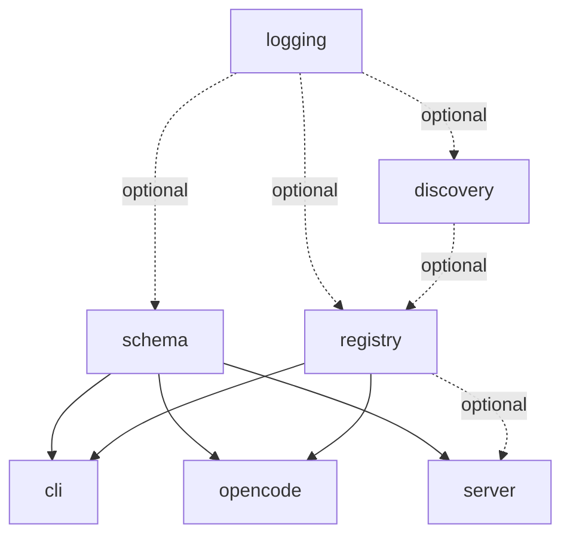

# CLI Structure Discovery

## Problem Statement

gunshi-mcp converts Zod schemas into multiple output formats:
- **Gunshi CLI arguments** - flags with types, descriptions, defaults
- **MCP tool schemas** - the `@modelcontextprotocol/server` library accepts either Zod schemas or JSON Schema directly; we prefer passing raw Zod
- **OpenCode tool definitions** - schema format TBD

The current `cli-args/` directory handles Zod-to-gunshi conversion with reasonable decomposition:

```
cli-args/
├── introspect.ts   # Analyze Zod types
├── flatten.ts      # Nested → flat flag names
├── collision.ts    # Detect naming collisions
├── arrays.ts       # Array handling strategies
├── overrides.ts    # User overrides, build GunshiArg
├── reconstruct.ts  # Flat values → nested object
├── types.ts        # Shared interfaces
└── index.ts        # Orchestrate pipeline
```

**The problems:**

1. **Naming is CLI-centric** - "cli-args" suggests this is only for CLI, but Zod introspection and flattening could serve MCP and OpenCode too

2. **Single monolithic pipeline** - The code flows introspect → flatten → build, but this isn't explicit. Users can't easily understand or customize the pipeline

3. **No shared schema foundation** - Each plugin (CLI, Server, OpenCode) will need to analyze Zod schemas. Currently there's no shared infrastructure

4. **Plugin structure unclear** - How does `cli/` relate to `cli-args/`? Where does the plugin wrapper live vs the schema logic?

5. **Extensibility** - If someone wants a different flattening strategy or custom array handling, the current structure doesn't make extension points obvious

---

## Option A: Keep cli-args as-is, nest under cli/

The existing decomposition is solid. Just move it under the cli plugin directory:

```
src/cli/
├── args/                 # Current cli-args/ moved here
│   ├── introspect.ts
│   ├── flatten.ts
│   ├── collision.ts
│   ├── arrays.ts
│   ├── overrides.ts
│   ├── reconstruct.ts
│   ├── types.ts
│   └── index.ts
├── commands.ts           # Generate gunshi commands from tools
├── plugin.ts             # createCliPlugin
└── index.ts
```

**Pros:**
- Minimal change, already works
- Clear ownership: cli/ owns everything CLI-related

**Cons:**
- `args/` name doesn't reflect that it's really "zod-to-gunshi"
- Zod introspection buried inside CLI, not reusable
- Other plugins will duplicate introspection logic

---

## Option B: Rename to reflect pipeline stages

Model the conversion as explicit pipeline stages:

```
src/cli/
├── schema/               # Zod schema analysis (no gunshi dependency)
│   ├── introspect.ts     # Type extraction from Zod
│   ├── flatten.ts        # Nested → flat
│   ├── collision.ts      # Validate no collisions
│   └── types.ts          # ZodFieldInfo, FlattenContext
│
├── args/                 # Gunshi arg building
│   ├── build.ts          # ZodFieldInfo → GunshiArg
│   ├── arrays.ts         # Array handling strategies
│   ├── overrides.ts      # Apply user overrides
│   └── types.ts          # CliOptions
│
├── values/               # Runtime value handling
│   ├── reconstruct.ts    # Flat values → nested object
│   └── parse.ts          # Custom parsers (JSON, etc.)
│
├── commands.ts           # Generate commands from GunshiTool
├── plugin.ts             # createCliPlugin
└── index.ts
```

**Pros:**
- Clear separation of concerns
- Easier to understand data flow
- `schema/` could potentially be lifted out later

**Cons:**
- More directories
- Still CLI-centric organization
- Duplication if server/ needs same schema logic

---

## Option C: Separate zod-schema as top-level module

The Zod introspection/flattening is useful beyond CLI. Make it a shared module:

```
src/
├── zod-schema/           # General Zod schema utilities
│   ├── introspect.ts     # Type analysis
│   ├── flatten.ts        # Flatten nested to flat keys
│   ├── collision.ts      # Detect collisions
│   ├── json-schema.ts    # Zod → JSON Schema (for MCP)
│   └── types.ts
│
├── cli/
│   ├── args/             # Gunshi-specific arg building
│   │   ├── build.ts
│   │   ├── arrays.ts
│   │   ├── overrides.ts
│   │   └── reconstruct.ts
│   ├── commands.ts
│   ├── plugin.ts
│   └── index.ts
│
├── server/
│   ├── schema/           # MCP-specific schema handling
│   │   └── tool-schema.ts
│   ├── ...
```

**Pros:**
- Reusable Zod utilities
- Cleaner plugin modules
- Clear shared foundation

**Cons:**
- Cross-module dependencies
- `zod-schema/` naming is generic
- No plugin for the shared schema logic

---

## Option D: Pipeline-as-transforms pattern

Model conversions as composable transforms:

```
src/cli/
├── transforms/
│   ├── zod-to-field-info.ts    # Zod → ZodFieldInfo[]
│   ├── flatten-fields.ts       # Nested → flat with collision check
│   ├── field-to-gunshi-arg.ts  # ZodFieldInfo → GunshiArg
│   ├── values-to-nested.ts     # Flat values → nested object
│   └── index.ts                # compose(transform1, transform2, ...)
├── commands.ts
├── plugin.ts
└── index.ts
```

**Pros:**
- Functional, composable
- Easy to test each transform
- Pipeline is explicit

**Cons:**
- Might be too abstract
- Still CLI-only
- "transforms" is vague

---

## Option Synthesis: Schema Plugin with Consumer-Specific Pipelines

### Introduction

The previous options each capture part of what we need but none provide a complete solution. Option A is too conservative and keeps CLI as a silo. Option B adds structure but doesn't solve reuse. Option C identifies the right shared layer but doesn't give it first-class status as a plugin. Option D has the right pipeline thinking but stays CLI-centric.

The synthesis option combines these insights:

1. **Schema as a first-class plugin** - A `schema` plugin provides shared Zod analysis infrastructure that other plugins depend on
2. **Explicit pipelines** - Each consumer (CLI, MCP, OpenCode) has a clear pipeline that transforms schema data to its output format
3. **Plugin-specific schema directories** - Each plugin can extend the shared schema infrastructure with consumer-specific logic
4. **Composable stages** - Pipeline stages are explicit, testable, and replaceable

### Detailed Description

The core insight is that Zod schema analysis is *infrastructure*, not an implementation detail of any single plugin. When you define a tool with a Zod schema, multiple consumers need to understand that schema:

- **CLI** needs to flatten nested objects into flags, handle arrays, generate help text
- **MCP Server** needs JSON Schema representation with proper types and descriptions
- **OpenCode** needs whatever schema format it requires (likely similar to MCP)

Rather than each plugin reimplementing Zod introspection, we create a **Schema Plugin** that:

1. Provides a `SchemaExtension` with methods to analyze Zod schemas
2. Exposes pipeline primitives: introspect, flatten, validate
3. Caches analysis results (a schema analyzed once doesn't need re-analysis)
4. Offers extension points for custom type handling

Each consumer plugin then depends on the Schema Plugin and builds its own pipeline on top of the shared foundation. The CLI plugin has a `cli/schema/` directory for CLI-specific transformations (ZodFieldInfo → GunshiArg). The Server plugin has `server/schema/` for MCP-specific transformations (ZodFieldInfo → JSON Schema).

The pipeline concept becomes explicit and user-facing. A tool author can understand:

```
Zod Schema
    ↓ [schema plugin: introspect]
ZodFieldInfo[]
    ↓ [schema plugin: flatten]
FlattenedField[]
    ↓ [cli plugin: toGunshiArgs]         ↓ [server plugin: pass-through]
GunshiArg[]                           Zod Schema (unchanged)
    ↓ [cli plugin: toCommand]            ↓ [server plugin: registerTool]
Gunshi Command                        MCP Tool
```

Note: The MCP server path is simpler because `@modelcontextprotocol/server` accepts Zod schemas directly. The schema plugin's introspect/flatten is primarily for CLI, but remains available for other consumers that need structured field information.

This makes the system understandable: there's a shared analysis phase, then consumer-specific output phases. Users who want to customize can intervene at any stage.

### Proposed Structure

```
src/
├── schema/                       # Schema Plugin - shared Zod analysis
│   ├── introspect/
│   │   ├── field.ts              # Extract ZodFieldInfo from a field
│   │   ├── unwrap.ts             # Unwrap optionals, defaults, etc.
│   │   ├── types.ts              # Introspection result types
│   │   └── index.ts
│   │
│   ├── flatten/
│   │   ├── flatten.ts            # Nested schema → flat fields
│   │   ├── collision.ts          # Detect/report collisions
│   │   ├── types.ts              # FlattenContext, FlattenOptions
│   │   └── index.ts
│   │
│   ├── validate/
│   │   ├── required.ts           # Validate required fields present
│   │   ├── types.ts              # Validate type compatibility
│   │   └── index.ts
│   │
│   ├── cache.ts                  # Cache analyzed schemas
│   ├── plugin.ts                 # createSchemaPlugin
│   ├── types.ts                  # SchemaExtension, shared types
│   └── index.ts                  # Re-exports
│
├── cli/
│   ├── schema/                   # CLI-specific schema transforms
│   │   ├── to-gunshi-arg.ts      # ZodFieldInfo → GunshiArg
│   │   ├── arrays.ts             # Array handling strategies
│   │   ├── overrides.ts          # Apply user overrides
│   │   └── index.ts
│   │
│   ├── values/
│   │   ├── reconstruct.ts        # Flat CLI values → nested object
│   │   ├── parse.ts              # Custom parsers
│   │   └── index.ts
│   │
│   ├── commands.ts               # Generate commands from tools
│   ├── plugin.ts                 # createCliPlugin (depends on schema)
│   └── index.ts
│
├── server/
│   ├── schema/                   # MCP-specific schema transforms
│   │   ├── to-json-schema.ts     # ZodFieldInfo → JSON Schema
│   │   ├── annotations.ts        # MCP-specific annotations
│   │   └── index.ts
│   │
│   ├── server.ts                 # McpServer factory
│   ├── tools.ts                  # Tool registration
│   ├── plugin.ts                 # createServerPlugin (depends on schema)
│   └── index.ts
│
├── opencode/
│   ├── schema/                   # OpenCode-specific transforms (TBD)
│   │   └── ...
│   ├── plugin.ts                 # createOpenCodePlugin (depends on schema)
│   └── index.ts
```

### Schema Plugin Extension

```typescript
export const SCHEMA_PLUGIN_ID = "gunshi-mcp:schema" as const

export interface SchemaExtension {
  /** Introspect a Zod schema, returning field information */
  introspect: <T extends z.ZodRawShape>(schema: z.ZodObject<T>) => ZodFieldInfo[]
  
  /** Flatten nested schema to flat keys with collision detection */
  flatten: <T extends z.ZodRawShape>(
    schema: z.ZodObject<T>,
    options?: FlattenOptions
  ) => FlattenedField[]
  
  /** Get cached analysis or compute fresh */
  analyze: <T extends z.ZodRawShape>(
    schema: z.ZodObject<T>,
    options?: AnalyzeOptions
  ) => SchemaAnalysis
  
  /** Register custom type handler for extension */
  registerTypeHandler: (typeName: string, handler: TypeHandler) => void
}

export interface SchemaAnalysis {
  fields: ZodFieldInfo[]
  flattened: FlattenedField[]
  required: string[]
  hasNested: boolean
  maxDepth: number
}
```

### Pipeline Visualization

The pipeline becomes a first-class concept users can reason about:

```typescript
// Conceptual pipeline (not necessarily literal API)
const cliPipeline = pipeline(
  schemaPlugin.introspect,      // Zod → ZodFieldInfo[]
  schemaPlugin.flatten,         // → FlattenedField[]
  cliPlugin.toGunshiArgs,       // → GunshiArg[]
  cliPlugin.applyOverrides,     // → GunshiArg[] (with user overrides)
)

// MCP pipeline is simpler - pass Zod directly
const mcpPipeline = pipeline(
  (tool) => tool.inputSchema,   // Zod schema pass-through
  serverPlugin.registerTool,    // McpServer accepts Zod directly
)
```

### Dependency Graph with Schema Plugin

```
                    ┌─────────┐
                    │ logging │
                    └────┬────┘
                         │ optional
            ┌────────────┼────────────┐
            ▼            ▼            ▼
      ┌──────────┐ ┌──────────┐ ┌──────────┐
      │ discovery│ │ registry │ │  schema  │ ← NEW
      └────┬─────┘ └────┬─────┘ └────┬─────┘
           │            │            │
           │  optional  │            │ required
           └─────►──────┤            │
                        │       ┌────┴────┐
           ┌────────────┤       │         │
           ▼            ▼       ▼         ▼
      ┌─────────┐  ┌─────────┐ ┌────┐ ┌────────┐
      │   cli   │  │opencode │ │svr │ │ server │
      └─────────┘  └─────────┘ └────┘ └────────┘
```



### Pros

1. **Single source of truth for Zod analysis** - No duplication across plugins
2. **Explicit pipelines** - Users understand the data flow
3. **Testable in isolation** - Each stage can be unit tested
4. **Extensible** - Custom type handlers, alternative flatten strategies
5. **Plugin-native** - Follows gunshi's plugin patterns with typed extensions
6. **Consumer-specific directories** - Each plugin owns its output transformations
7. **Cacheable** - Schema analysis can be cached and reused
8. **Library-friendly** - Schema utilities usable outside gunshi context

### Cons

1. **More plugins** - Adds a 7th plugin to the inventory
2. **Dependency complexity** - CLI, Server, OpenCode all depend on Schema
3. **Potential over-engineering** - For simple cases, this is heavyweight
4. **Migration effort** - Significant refactor of existing cli-args/
5. **API surface** - More types and interfaces to document
6. **Learning curve** - Users need to understand the pipeline concept

---

## Follow-up Questions & Design Decisions

### 1. Schema Plugin Granularity

**Question:** Should the schema plugin expose low-level primitives (introspect, flatten separately) or high-level analysis (one `analyze()` call)?

**Proposed answer:** Both. Provide `analyze()` for common cases that returns a complete `SchemaAnalysis`, but also expose individual functions for users who want to customize the pipeline.

### 2. Caching Strategy

**Question:** How do we cache schema analysis? Key by schema reference? Schema shape hash?

**Proposed answer:** Use a WeakMap keyed by schema reference for automatic garbage collection. For serialization scenarios, provide an optional string-based cache key.

```typescript
const schemaCache = new WeakMap<z.ZodObject<any>, SchemaAnalysis>()
```

### 3. Flatten Options Ownership

**Question:** Who owns flatten options (separator, maxDepth)? Schema plugin? CLI plugin?

**Proposed answer:** Schema plugin owns the flatten operation and its options. CLI plugin passes its preferences when calling `flatten()`. This keeps the schema plugin general while allowing CLI-specific defaults.

```typescript
// CLI plugin calls schema plugin with its preferences
const flattened = schemaExt.flatten(tool.inputSchema, {
  separator: cliOptions.separator ?? "-",
  maxDepth: cliOptions.maxDepth ?? 3,
})
```

### 4. Type Handler Extension

**Question:** How do users register custom type handlers for exotic Zod types?

**Proposed answer:** The schema plugin accepts handlers in its options and provides a runtime registration method:

```typescript
createSchemaPlugin({
  typeHandlers: {
    "ZodBranded": (schema) => ({ type: "string", ... }),
  },
})

// Or at runtime
schemaExt.registerTypeHandler("ZodBranded", handler)
```

### 5. JSON Schema Generation Location

**Question:** Does JSON Schema generation belong in schema/ or server/?

**Proposed answer:** The `@modelcontextprotocol/server` library accepts Zod schemas directly (it handles conversion internally), so we prefer passing raw Zod schemas to MCP rather than converting ourselves. This means:

- **Server plugin does NOT need JSON Schema conversion** - pass Zod directly to McpServer
- **Schema plugin may still provide `toJsonSchema()`** for other consumers (documentation, OpenAPI, external validation)
- **Annotations stay in server/** - MCP-specific metadata like `annotations` field

```
schema/json-schema.ts        → General Zod → JSON Schema (optional utility)
server/                      → Pass raw Zod to McpServer.registerTool()
```

This simplifies the server plugin significantly - it just passes the tool's `inputSchema` (Zod) directly to MCP.

### 6. Runtime Value Reconstruction

**Question:** Where does flat-to-nested value reconstruction live?

**Proposed answer:** This is CLI-specific (reconstructing CLI flag values back to nested objects). It stays in `cli/values/reconstruct.ts`. The schema plugin doesn't deal with runtime values, only schema analysis.

### 7. Error Handling

**Question:** How do we handle schema analysis errors (unsupported types, collisions)?

**Proposed answer:** 
- Return errors in the analysis result rather than throwing
- Provide a `strict` mode that throws on first error
- Collisions return a warning by default, error in strict mode

```typescript
interface SchemaAnalysis {
  fields: ZodFieldInfo[]
  warnings: SchemaWarning[]
  errors: SchemaError[]
  isValid: boolean
}
```

### 8. Plugin vs Utility

**Question:** Does schema *need* to be a plugin, or could it just be utility functions?

**Proposed answer:** Plugin provides benefits:
- Caching across command invocations
- Extension registration persists
- Other plugins can declare dependency
- Follows the established pattern

However, the underlying functions should be exported for use outside gunshi context. The plugin wraps them.

```typescript
// Direct utility use (no gunshi)
import { introspectSchema, flattenSchema } from "gunshi-mcp/schema"

// Plugin use (with gunshi)
const schemaExt = ctx.extensions["gunshi-mcp:schema"]
schemaExt.analyze(mySchema)
```

### 9. Builder Integration

**Question:** How does the builder handle the schema plugin?

**Proposed answer:** Schema is auto-included when CLI, Server, or OpenCode are added. Users don't need to explicitly add it unless they want to configure it.

```typescript
gunshiMcp()
  .withCli()  // Automatically includes schema plugin
  .build()

// Explicit configuration
gunshiMcp()
  .withSchema({ typeHandlers: { ... } })
  .withCli()
  .build()
```

### 10. Naming: "Schema" vs alternatives

**Question:** Is "schema" the right name? Alternatives: "zod", "types", "analysis"

**Proposed answer:** "Schema" is correct because:
- It's the domain (schema analysis)
- It's not Zod-specific in concept (even if implementation uses Zod)
- "analysis" is a verb, "types" is too generic

Plugin ID: `gunshi-mcp:schema`

---

## Summary

The Synthesis option introduces a Schema Plugin as shared infrastructure for Zod schema analysis, with explicit pipelines that transform schema data into consumer-specific outputs. Each plugin (CLI, Server, OpenCode) has its own `schema/` subdirectory for consumer-specific transformations.

This approach:
- Makes the pipeline concept explicit and user-facing
- Eliminates duplication of Zod analysis logic
- Follows gunshi's plugin architecture
- Provides clear extension points
- Balances shared infrastructure with consumer-specific needs

The main tradeoff is added complexity (one more plugin, more directories) in exchange for better separation of concerns and reusability.
