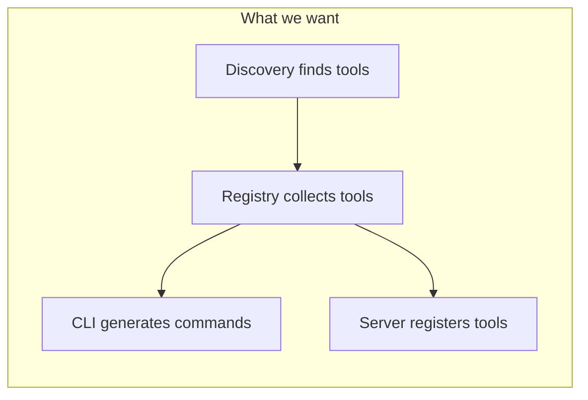
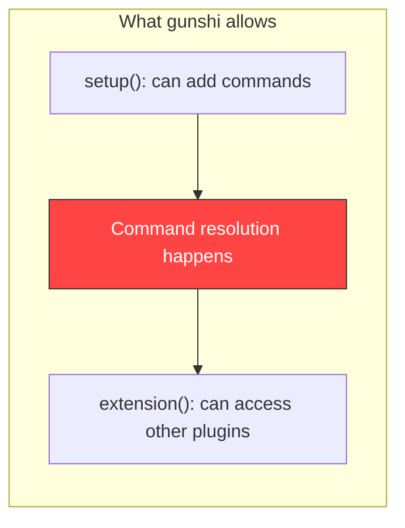
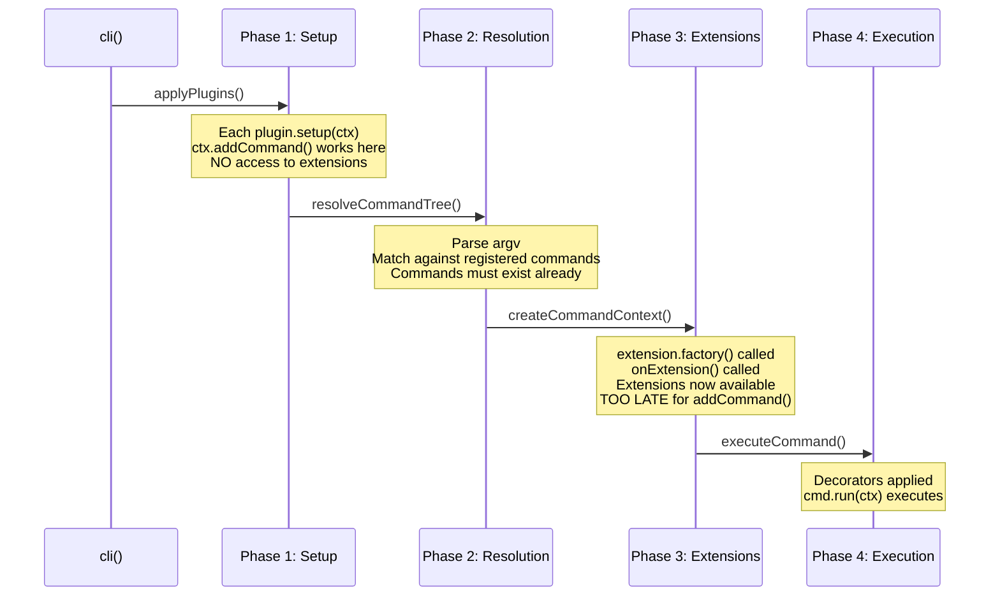
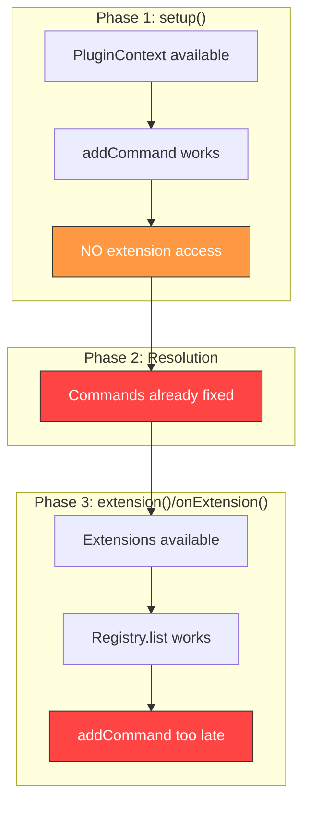
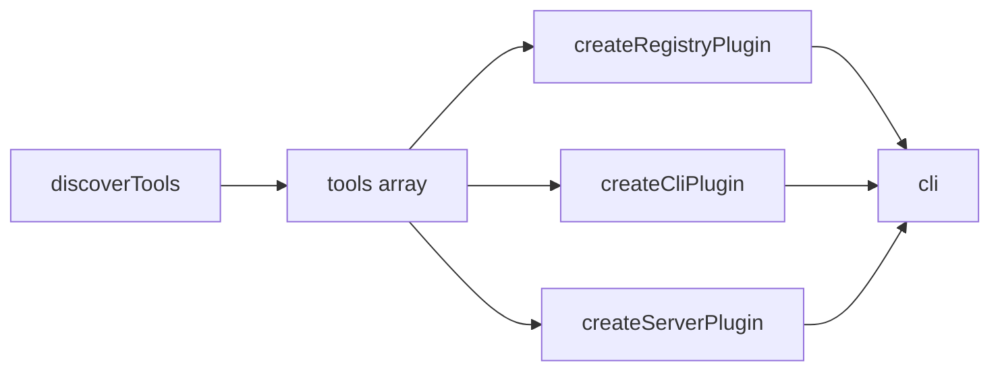
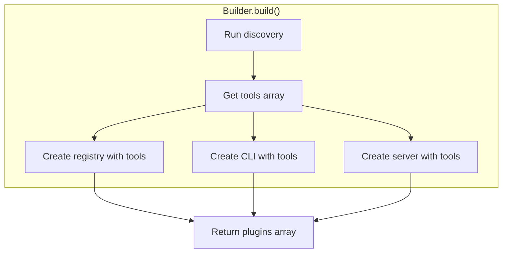
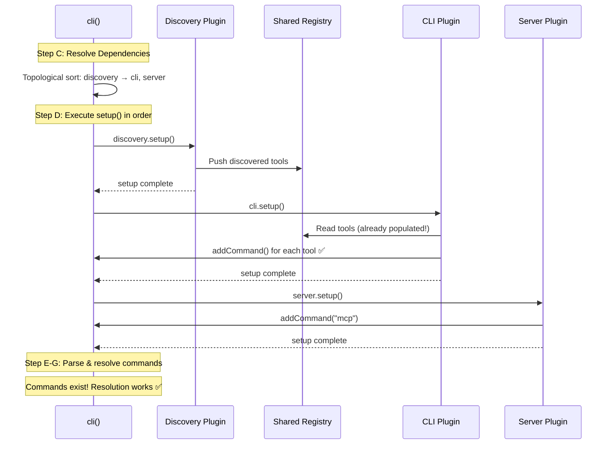
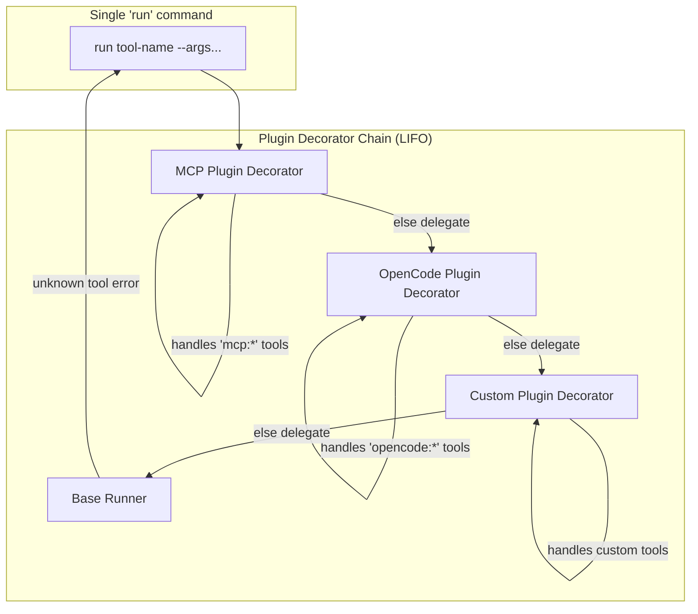
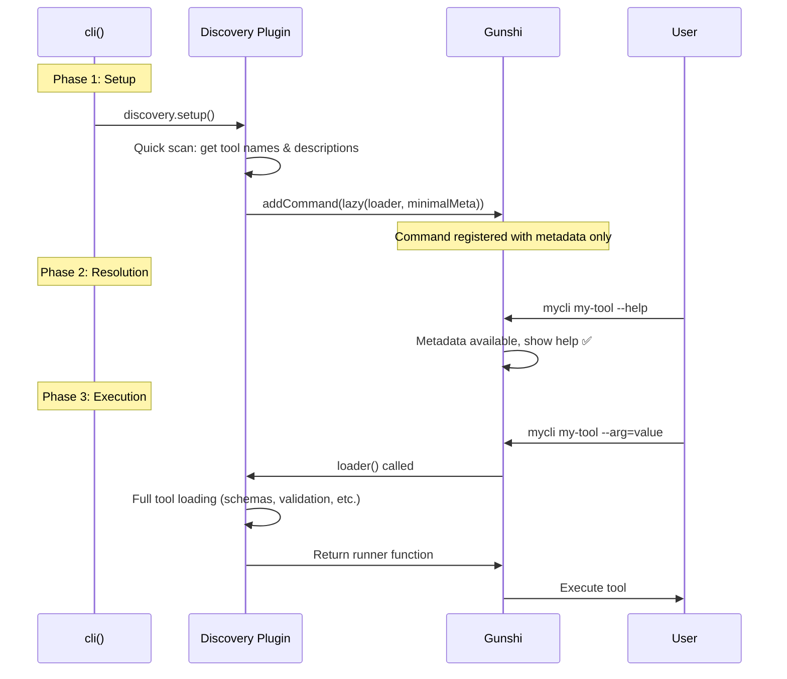

# Gunshi Lifecycle & Plugin Composition Challenge

This document analyzes how the gunshi plugin lifecycle interacts with our composable plugin architecture, identifies a fundamental timing problem, and explores solutions.

## Table of Contents

- [Problem Statement](#problem-statement)
- [Gunshi Lifecycle Deep Dive](#gunshi-lifecycle-deep-dive)
  - [Source References](#source-references)
  - [The Four Phases](#the-four-phases)
  - [Phase 1: Plugin Setup](#phase-1-plugin-setup)
  - [Phase 2: Command Resolution](#phase-2-command-resolution)
  - [Phase 3: Extension Creation](#phase-3-extension-creation)
  - [The Timing Mismatch](#the-timing-mismatch)
- [Current Implementation Analysis](#current-implementation-analysis)
  - [CLI Plugin (src/cli/plugin.ts)](#cli-plugin-srccliplugints)
  - [Server Plugin (src/server/plugin.ts)](#server-plugin-srcserverplugints)
  - [Discovery Plugin (src/discovery/plugin.ts)](#discovery-plugin-srcdiscoveryplugints)
- [Solution Space](#solution-space)
  - [Option A: Pre-Discovery Pattern](#option-a-pre-discovery-pattern)
  - [Option B: Builder Orchestration](#option-b-builder-orchestration)
  - [Option C: Lazy Command Pattern](#option-c-lazy-command-pattern)
  - [Option D: Two-Phase CLI](#option-d-two-phase-cli)
  - [Option E: Gunshi Enhancement](#option-e-gunshi-enhancement)
  - [Option F: Setup-time Shared State via Dependencies](#option-f-setup-time-shared-state-via-dependencies)
  - [Option G: Dispatcher Command with Plugin Decorators](#option-g-dispatcher-command-with-plugin-decorators)
  - [Option H: Lazy Commands with Minimal Metadata](#option-h-lazy-commands-with-minimal-metadata)
- [Recommended Approach](#recommended-approach)
  - [Implementation Changes Required](#implementation-changes-required)
- [Summary](#summary)

## Problem Statement

**PLAN-library.md envisions:**

```typescript
await cli(args, command, {
	plugins: [
		createDiscoveryPlugin({ patterns: ["tools/**/*.ts"] }),
		createRegistryPlugin({ autoDiscover: true }),
		createServerPlugin({ name: "my-app" }),
		createCliPlugin(),
	],
})
```

The design assumes plugins can depend on each other's extensions:

- **Discovery** finds tools on the filesystem
- **Registry** collects tools (from discovery or explicit registration)
- **CLI Plugin** reads from registry and generates commands
- **Server Plugin** reads from registry and registers MCP tools
- **OpenCode Plugin** reads from registry and exposes tools

**The Problem**: Gunshi's lifecycle doesn't support this pattern. By the time a plugin can access another plugin's extension, it's too late to add commands.





---

## Gunshi Lifecycle Deep Dive

### Source References

All links reference the gunshi repository at https://github.com/kazupon/gunshi:

| File                                                                                                   | Purpose                 |
| ------------------------------------------------------------------------------------------------------ | ----------------------- |
| [cli/core.ts](https://github.com/kazupon/gunshi/blob/main/packages/gunshi/src/cli/core.ts)             | Main CLI execution      |
| [context.ts](https://github.com/kazupon/gunshi/blob/main/packages/gunshi/src/context.ts)               | CommandContext creation |
| [plugin/core.ts](https://github.com/kazupon/gunshi/blob/main/packages/gunshi/src/plugin/core.ts)       | Plugin definition       |
| [plugin/context.ts](https://github.com/kazupon/gunshi/blob/main/packages/gunshi/src/plugin/context.ts) | PluginContext API       |

### The Four Phases



### Phase 1: Plugin Setup

**Source**: [cli/core.ts#L116-L136](https://github.com/kazupon/gunshi/blob/main/packages/gunshi/src/cli/core.ts#L116-L136)

```typescript
async function applyPlugins(pluginContext, plugins) {
	const sortedPlugins = resolveDependencies(plugins)
	for (const plugin of sortedPlugins) {
		await plugin(pluginContext) // Calls setup()
	}
	return sortedPlugins
}
```

**PluginContext capabilities** ([plugin/context.ts#L39-L142](https://github.com/kazupon/gunshi/blob/main/packages/gunshi/src/plugin/context.ts#L39-L142)):

| Method                          | Available in setup()? |
| ------------------------------- | --------------------- |
| `addCommand(name, cmd)`         | ✅ Yes                |
| `addGlobalOption(name, schema)` | ✅ Yes                |
| `decorateCommand(decorator)`    | ✅ Yes                |
| Access to other extensions      | ❌ No                 |

### Phase 2: Command Resolution

**Source**: [cli/core.ts#L259-L413](https://github.com/kazupon/gunshi/blob/main/packages/gunshi/src/cli/core.ts#L259-L413)

Gunshi walks the command tree to find which command matches the user's input. **Commands must be registered during Phase 1** to be discoverable.

### Phase 3: Extension Creation

**Source**: [context.ts#L214-L228](https://github.com/kazupon/gunshi/blob/main/packages/gunshi/src/context.ts#L214-L228)

```typescript
for (const [key, extension] of Object.entries(extensions)) {
	ext[key] = await extension.factory(core, command)
	if (extension.onFactory) {
		await extension.onFactory(core, command) // onExtension hook
	}
}
```

Extensions are created **after** command resolution. Calling `addCommand()` here adds to the internal map but the command won't be reachable.

### The Timing Mismatch



---

## Current Implementation Analysis

### CLI Plugin (src/cli/plugin.ts)

```typescript
export function createCliPlugin(options = {}) {
	return plugin({
		id: CLI_PLUGIN_ID,
		dependencies: [SCHEMA_PLUGIN_ID, REGISTRY_PLUGIN_ID],

		setup: (ctx) => {
			pluginCtxRef = ctx // Store for later... but later is too late
		},

		onExtension: (cmdCtx) => {
			const registryExt = cmdCtx.extensions[REGISTRY_PLUGIN_ID]
			// Now we have registry, but...
			registeredCommands = generateCommands({
				addCommand: pluginCtxRef.addCommand, // ⚠️ Too late!
			})
		},
	})
}
```

**Problem**: We need registry tools to generate commands, but registry extension isn't available until after command resolution.

### Server Plugin (src/server/plugin.ts)

```typescript
export function createServerPlugin(options = {}) {
  return plugin({
    setup: async (ctx) => {
      ctx.addCommand("mcp", {...})  // ✅ This works
    },

    extension: (ctx) => {
      if (options.autoRegister) {
        const registry = ctx.extensions[REGISTRY_PLUGIN_ID]
        // Register tools with MCP server - this works because
        // we're not adding commands, just registering MCP tools
      }
    },
  })
}
```

**This works** because registering MCP tools doesn't require `addCommand()`. The "mcp" command is static.

### Discovery Plugin (src/discovery/plugin.ts)

```typescript
export function createDiscoveryPlugin(options = {}) {
  return plugin({
    setup: async (ctx) => {
      discoveredTools = await runDiscovery()  // ✅ Runs during setup
      ctx.addCommand("tools", {...})  // ✅ Static command works
    },
  })
}
```

**This works** because discovery runs synchronously during setup. But other plugins can't access `discoveredTools` until Phase 3.

---

## Solution Space

### Option A: Pre-Discovery Pattern

Run discovery before calling `cli()`, pass results explicitly:

```typescript
// Discovery happens BEFORE gunshi
const tools = await discoverTools({ patterns: ["tools/**/*.ts"] })

await cli(args, command, {
	plugins: [
		createRegistryPlugin({ tools }), // Tools passed directly
		createCliPlugin({ tools }), // Tools passed directly
		createServerPlugin({ tools }), // Tools passed directly
	],
})
```



**Pros:**

- Simple, explicit
- Each plugin has tools during setup
- No lifecycle gymnastics

**Cons:**

- Breaks the "composable plugins" vision
- User must wire tools to each plugin manually
- Registry becomes redundant

### Option B: Builder Orchestration

The builder handles tool passing internally:

```typescript
const plugins = await gunshiMcp()
	.withDiscovery({ patterns: ["tools/**/*.ts"] })
	.withRegistry({ autoDiscover: true })
	.withCli()
	.withServer()
	.build()

await cli(args, command, { plugins })
```

Internally, `build()` does:

```typescript
async build() {
  // Run discovery first
  const tools = await discoverTools(this.config.discovery)

  // Pass tools to each plugin
  return [
    createRegistryPlugin({ tools }),
    createCliPlugin({ tools }),
    createServerPlugin({ tools }),
  ]
}
```



**Pros:**

- Maintains fluent API
- User doesn't see the wiring
- Plugins remain focused

**Cons:**

- Builder becomes load-bearing
- Discovery must be synchronous relative to plugin creation
- Registry plugin becomes a facade

### Option C: Lazy Command Pattern

Don't generate per-tool commands. Use a single dispatcher:

```typescript
setup: (ctx) => {
	ctx.addCommand("run", {
		name: "run",
		description: "Run a tool by name",
		args: {
			tool: { type: "string", required: true },
			// Generic args passed through
		},
		run: async (cmdCtx) => {
			const registry = cmdCtx.extensions[REGISTRY_PLUGIN_ID]
			const tool = registry.get(cmdCtx.values.tool)
			// Parse remaining args and execute
		},
	})
}
```

Usage: `mycli run fetch-data --url=...` instead of `mycli fetch-data --url=...`

**Pros:**

- Works with current lifecycle
- No timing issues
- Dynamic tool list

**Cons:**

- Worse UX (extra "run" subcommand)
- No per-tool help generation
- Feels like a workaround

### Option D: Two-Phase CLI

Run gunshi twice: first for discovery, second for execution:

```typescript
// Phase 1: Discovery run
const { tools } = await cli(args, discoveryCommand, {
	plugins: [createDiscoveryPlugin()],
})

// Phase 2: Full run with tools
await cli(args, mainCommand, {
	plugins: [
		createRegistryPlugin({ tools }),
		createCliPlugin({ tools }),
		createServerPlugin({ tools }),
	],
})
```

**Pros:**

- Clean separation
- Each phase is simple

**Cons:**

- Startup overhead
- Complex to implement correctly
- Confusing mental model

### Option E: Gunshi Enhancement

Propose a new lifecycle hook to gunshi:

```typescript
plugin({
  // New hook: runs after all setup(), before resolution
  afterSetup: (ctx, allExtensions) => {
    const registry = allExtensions[REGISTRY_PLUGIN_ID]
    for (const tool of registry.list()) {
      ctx.addCommand(tool.name, {...})
    }
  },
})
```

**Pros:**

- Solves the problem properly
- Benefits other gunshi users

**Cons:**

- Requires upstream change
- Not available now

### Option F: Setup-time Shared State via Dependencies

> See also **Option G** below for a decorator-based variant that combines well with this approach.

**The key insight**: Gunshi runs `setup()` in **dependency order** (topological sort). A dependency plugin's `setup()` completes *before* a dependent plugin's `setup()` begins. This means plugins can share state during setup—not just during the extension phase.

```typescript
// Shared mutable state container
const toolRegistry: Tool[] = []

// Discovery plugin runs FIRST (no dependencies)
const discoveryPlugin = plugin({
  id: 'discovery',
  setup: async (ctx) => {
    // Discovery runs synchronously during setup
    const tools = await discoverTools({ patterns: ["tools/**/*.ts"] })
    toolRegistry.push(...tools)  // Populate shared state
    
    ctx.addCommand("tools", { /* list discovered tools */ })
  },
})

// CLI plugin depends on discovery, runs SECOND
const cliPlugin = plugin({
  id: 'cli',
  dependencies: ['discovery'],  // Ensures discovery.setup() completes first
  setup: (ctx) => {
    // toolRegistry is already populated!
    for (const tool of toolRegistry) {
      ctx.addCommand(tool.name, generateToolCommand(tool))
    }
  },
})

// Server plugin also depends on discovery
const serverPlugin = plugin({
  id: 'server',
  dependencies: ['discovery'],
  setup: (ctx) => {
    ctx.addCommand("mcp", { /* ... */ })
  },
  extension: () => {
    // Can use toolRegistry here too for MCP tool registration
    return { tools: toolRegistry }
  },
})
```



**Pros:**

- Works with current gunshi lifecycle—no upstream changes needed
- Plugins remain composable with clear dependency declarations
- Commands are registered during `setup()` where they belong
- Uses gunshi's type-safe dependency system
- Discovery and CLI can be separate concerns

**Cons:**

- Requires shared mutable state (module-level variable)
- Less elegant than extension-based communication
- Discovery plugin must be synchronous or use top-level await

**Implementation approach:**

```typescript
// src/shared/registry.ts
export interface Tool { name: string; /* ... */ }
export const sharedRegistry: Tool[] = []

// src/discovery/plugin.ts
import { sharedRegistry } from '../shared/registry.ts'

export function createDiscoveryPlugin(options) {
  return plugin({
    id: DISCOVERY_PLUGIN_ID,
    setup: async (ctx) => {
      const tools = await discoverTools(options)
      sharedRegistry.push(...tools)
    },
  })
}

// src/cli/plugin.ts
import { sharedRegistry } from '../shared/registry.ts'

export function createCliPlugin(options) {
  return plugin({
    id: CLI_PLUGIN_ID,
    dependencies: [DISCOVERY_PLUGIN_ID],
    setup: (ctx) => {
      for (const tool of sharedRegistry) {
        ctx.addCommand(tool.name, generateCommand(tool))
      }
    },
  })
}
```

### Option G: Dispatcher Command with Plugin Decorators

> See also **Option H** below for a lazy loading variant that provides better UX.

This option uses a **single dispatcher command** (like `run <tool>`) combined with **plugin decorators** to allow multiple plugins to contribute tool execution logic. Each plugin decorates the dispatcher to add its own tools.



**How it works:**

1. A base plugin registers a single `run` command during `setup()`
2. Each tool-providing plugin uses `decorateCommand()` to wrap the runner
3. Decorators check if they handle the requested tool; if not, delegate to the next decorator
4. Decorators execute in LIFO order (last registered = first executed)

```typescript
// Base dispatcher plugin - provides the 'run' command
const dispatcherPlugin = plugin({
  id: 'dispatcher',
  setup: (ctx) => {
    ctx.addCommand('run', {
      name: 'run',
      description: 'Run a tool by name',
      args: {
        tool: { type: 'string', description: 'Tool name to execute' },
      },
      run: async (cmdCtx) => {
        // Base case: no decorator handled the tool
        throw new Error(`Unknown tool: ${cmdCtx.values.tool}`)
      },
    })
  },
})

// MCP tools plugin - decorates 'run' to handle MCP tools
const mcpToolsPlugin = plugin({
  id: 'mcp-tools',
  dependencies: ['dispatcher'],
  setup: (ctx) => {
    // Register decorator during setup
    ctx.decorateCommand(baseRunner => async (cmdCtx) => {
      // Only intercept the 'run' command
      if (cmdCtx.name !== 'run') {
        return baseRunner(cmdCtx)
      }

      const toolName = cmdCtx.values.tool as string

      // Check if this plugin handles the tool
      if (toolName.startsWith('mcp:') || mcpTools.has(toolName)) {
        const tool = mcpTools.get(toolName)
        return await executeMcpTool(tool, cmdCtx)
      }

      // Not our tool, delegate to next decorator
      return baseRunner(cmdCtx)
    })
  },
  extension: () => ({
    // MCP tools can also be accessed via extension
    listTools: () => [...mcpTools.keys()],
  }),
})

// Discovery plugin - decorates 'run' to handle discovered tools
const discoveryPlugin = plugin({
  id: 'discovery',
  dependencies: ['dispatcher'],
  setup: async (ctx) => {
    // Discover tools during setup
    const discoveredTools = await discoverTools({ patterns: ['tools/**/*.ts'] })

    // Register decorator to handle discovered tools
    ctx.decorateCommand(baseRunner => async (cmdCtx) => {
      if (cmdCtx.name !== 'run') {
        return baseRunner(cmdCtx)
      }

      const toolName = cmdCtx.values.tool as string
      const tool = discoveredTools.find(t => t.name === toolName)

      if (tool) {
        return await executeDiscoveredTool(tool, cmdCtx)
      }

      // Not our tool, delegate
      return baseRunner(cmdCtx)
    })
  },
})

// OpenCode plugin - another tool provider
const openCodePlugin = plugin({
  id: 'opencode',
  dependencies: ['dispatcher'],
  setup: (ctx) => {
    ctx.decorateCommand(baseRunner => async (cmdCtx) => {
      if (cmdCtx.name !== 'run') {
        return baseRunner(cmdCtx)
      }

      const toolName = cmdCtx.values.tool as string

      if (openCodeTools.has(toolName)) {
        return await executeOpenCodeTool(toolName, cmdCtx)
      }

      return baseRunner(cmdCtx)
    })
  },
})
```

**Usage:**

```bash
# Run an MCP tool
mycli run mcp:fetch-data --url=https://example.com

# Run a discovered tool
mycli run my-custom-tool --input=data.json

# Run an OpenCode tool
mycli run opencode:search --query="find bugs"

# List all available tools (each plugin contributes)
mycli tools list
```

**Enhanced: Tool Listing via Extensions**

Plugins can also provide a `listTools()` method via their extensions, allowing a `tools list` command to aggregate all available tools:

```typescript
const toolsListPlugin = plugin({
  id: 'tools-list',
  setup: (ctx) => {
    ctx.addCommand('tools', {
      name: 'tools',
      description: 'List available tools',
      run: async (cmdCtx) => {
        const allTools: string[] = []

        // Aggregate tools from all extensions that provide listTools()
        for (const [id, ext] of Object.entries(cmdCtx.extensions)) {
          if (ext && typeof ext.listTools === 'function') {
            const tools = ext.listTools()
            allTools.push(...tools.map(t => `${id}:${t}`))
          }
        }

        console.log('Available tools:')
        allTools.forEach(t => console.log(`  - ${t}`))
      },
    })
  },
})
```

**Pros:**

- Works with current gunshi lifecycle—no timing issues
- Each plugin independently contributes tools via decorators
- Plugins don't need to know about each other
- Highly extensible: new plugins just add decorators
- Tool namespacing prevents conflicts (`mcp:tool`, `opencode:tool`)
- Can combine with Option F for per-tool commands too

**Cons:**

- UX requires extra `run` subcommand: `mycli run tool-name` instead of `mycli tool-name`
- No automatic per-tool help generation (but can implement `run --help tool-name`)
- Decorator chain overhead (minimal in practice)
- Tool argument parsing is manual (not schema-validated by gunshi)

**Hybrid approach: Combine with Option F**

Use Option F to generate individual commands for common tools, and Option G's dispatcher for dynamic/plugin-contributed tools:

```typescript
// Common tools get direct commands (Option F)
mycli fetch-data --url=...

// Plugin-contributed tools use dispatcher (Option G)
mycli run opencode:search --query=...
```

### Option H: Lazy Commands with Minimal Metadata

Gunshi's `lazy()` function separates **command metadata** (available immediately) from **command implementation** (loaded on execution). This allows registering commands during `setup()` with just enough metadata for help text, while deferring the actual tool loading.

**Key insight**: The `lazy(loader, metadata)` function:
- **Metadata**: Bundled immediately, used for `--help` and command resolution
- **Loader**: Called only when the command is actually executed

This means we can discover tool *names and descriptions* quickly during `setup()`, register lazy commands, and defer heavy tool loading until execution.



**Implementation:**

```typescript
import { plugin } from 'gunshi/plugin'
import { lazy, define } from 'gunshi'

// Discovery plugin with lazy loading
const discoveryPlugin = plugin({
  id: 'discovery',
  setup: async (ctx) => {
    // Quick discovery: just get tool names and basic metadata
    // This should be FAST - no full parsing of tool implementations
    const toolManifests = await quickDiscoverToolManifests({
      patterns: ['tools/**/*.ts'],
    })

    // Register lazy commands for each discovered tool
    for (const manifest of toolManifests) {
      // Minimal metadata - enough for help text
      const minimalMeta = define({
        name: manifest.name,
        description: manifest.description,
        // Basic args schema if available from manifest
        args: manifest.args ?? {},
      })

      // Loader - called only on execution
      const loader = async () => {
        // Full tool loading happens here
        const fullTool = await loadFullTool(manifest.path)
        
        // Return the runner function
        return async (cmdCtx) => {
          // Validate args against full schema
          const validated = fullTool.schema.parse(cmdCtx.values)
          return await fullTool.execute(validated)
        }
      }

      // Register lazy command
      const lazyCmd = lazy(loader, minimalMeta)
      ctx.addCommand(lazyCmd.commandName, lazyCmd)
    }
  },
})
```

**Two-tier discovery pattern:**

```typescript
// Tier 1: Quick manifest discovery (runs during setup)
async function quickDiscoverToolManifests(options) {
  const files = await glob(options.patterns)
  const manifests = []
  
  for (const file of files) {
    // Option A: Read frontmatter/JSDoc from file without executing
    const manifest = await extractToolManifest(file)
    
    // Option B: Use a manifest file (tools/manifest.json)
    // Option C: Use naming conventions (tool name = filename)
    
    manifests.push({
      name: manifest.name,
      description: manifest.description,
      args: manifest.args,  // Basic schema
      path: file,
    })
  }
  
  return manifests
}

// Tier 2: Full tool loading (runs on command execution)
async function loadFullTool(path) {
  const module = await import(path)
  return {
    schema: module.schema,      // Full Zod/validation schema
    execute: module.execute,    // Implementation
    // ... other heavy dependencies
  }
}
```

**Manifest file approach (fastest):**

```json
// tools/manifest.json - generated at build time or manually maintained
{
  "tools": [
    {
      "name": "fetch-data",
      "description": "Fetch data from a URL",
      "path": "./fetch-data.ts",
      "args": {
        "url": { "type": "string", "required": true },
        "format": { "type": "string", "default": "json" }
      }
    },
    {
      "name": "process-file",
      "description": "Process a file",
      "path": "./process-file.ts",
      "args": {
        "input": { "type": "string", "required": true }
      }
    }
  ]
}
```

```typescript
// Fast setup using manifest
setup: async (ctx) => {
  const manifest = await import('./tools/manifest.json')
  
  for (const tool of manifest.tools) {
    const lazyCmd = lazy(
      async () => {
        const mod = await import(tool.path)
        return mod.run
      },
      define({
        name: tool.name,
        description: tool.description,
        args: tool.args,
      })
    )
    ctx.addCommand(lazyCmd.commandName, lazyCmd)
  }
}
```

**Pros:**

- Full per-tool commands: `mycli my-tool --help` works correctly
- Gunshi handles argument parsing and validation
- Fast startup: heavy tool code loads only on execution
- Works with current lifecycle—no timing hacks
- Can combine with Option G for plugin-contributed tools

**Cons:**

- Requires two-tier discovery (quick manifest + full load)
- Manifest must be available at setup time (may need build step)
- Can't dynamically discover tools that don't have manifests
- Slight complexity in maintaining manifest ↔ implementation sync

**When to use:**

- You have many tools and want fast `--help` response
- Tools have predictable metadata that can be extracted quickly
- You're willing to maintain a manifest file or extract metadata statically

---

## Recommended Approach

**Option B (Builder Orchestration)** is the pragmatic choice:

1. The builder already exists
2. It can run discovery before creating plugins
3. Tools are passed explicitly to each plugin
4. User experience remains clean

```typescript
// User writes:
const plugins = await gunshiMcp()
	.withDiscovery({ patterns: ["tools/**/*.ts"] })
	.withCli()
	.withServer({ name: "my-app" })
	.build()

// Builder internally:
// 1. Runs discovery synchronously
// 2. Collects tools
// 3. Passes tools to CLI plugin options
// 4. Passes tools to Server plugin options
// 5. Returns configured plugins
```

This means:

- **CLI Plugin** accepts `tools` option, generates commands in `setup()`
- **Server Plugin** accepts `tools` option (already does via `options.tools`)
- **Registry Plugin** becomes optional (builder can skip if not explicitly requested)
- **Discovery Plugin** runs during `build()`, not as a gunshi plugin

### Implementation Changes Required

1. **Update CLI Plugin**: Add `tools` option, generate commands in `setup()`
2. **Update Builder**: Run discovery during `build()`, pass tools to plugins
3. **Update Server Plugin**: Already accepts `tools`, verify it works standalone
4. **Document**: The registry/discovery plugins are for advanced use cases

---

## Summary

| Approach                      | Complexity | UX Impact                   | Recommended?                  |
| ----------------------------- | ---------- | --------------------------- | ----------------------------- |
| A: Pre-Discovery              | Low        | Medium (manual wiring)      | For simple cases              |
| B: Builder Orchestration      | Medium     | None (hidden complexity)    | ✅ Yes                        |
| C: Lazy Commands              | Low        | High (UX regression)        | No (see Option G/H)           |
| D: Two-Phase CLI              | High       | Low                         | No                            |
| E: Gunshi Enhancement         | High       | None                        | Future possibility            |
| F: Setup-time Shared State    | Medium     | None                        | ✅ Yes (native gunshi way)    |
| G: Dispatcher + Decorators    | Medium     | Medium (`run` subcommand)   | ✅ Yes (plugin extensibility) |
| H: Lazy Commands + Manifest   | Medium     | None (full per-tool UX)     | ✅ Yes (best UX + performance)|

The fundamental tension is between gunshi's lifecycle (extensions after commands) and our architecture (commands from extensions). 

**Option H** provides the best UX—full per-tool commands with `--help` support—by using gunshi's `lazy()` to separate metadata (available at setup) from implementation (loaded on execution). Requires a manifest or quick metadata extraction.

**Option F** is the most "gunshi-native" approach—it uses the dependency system as intended, with `setup()` running in topological order. The downside is module-level shared state.

**Option G** builds on Option C but leverages gunshi's decorator system for plugin extensibility. Each plugin can independently contribute tools without coordination. The tradeoff is requiring a `run` subcommand.

**Option B** resolves this by moving discovery outside the gunshi lifecycle while keeping the user-facing API clean. It's cleaner from a state management perspective but less integrated with gunshi's plugin model.

**Hybrid recommendation**: Combine **F + H + G**:
- **H** for discovered tools with manifests (best UX, lazy loading)
- **F** for tools that need full schema at setup time
- **G** for dynamic plugin-contributed tools without manifests
