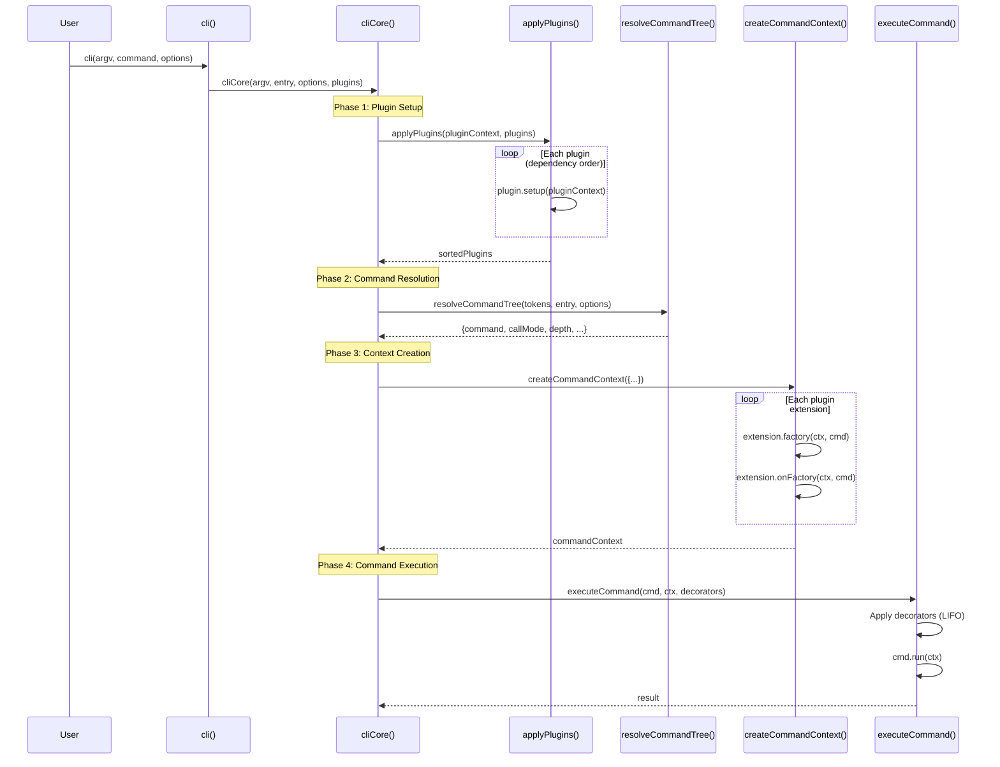
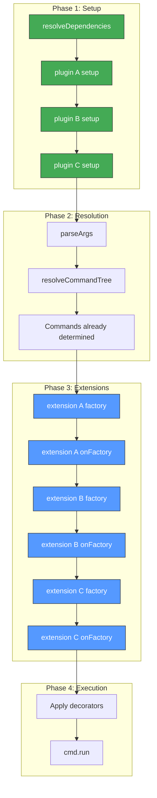
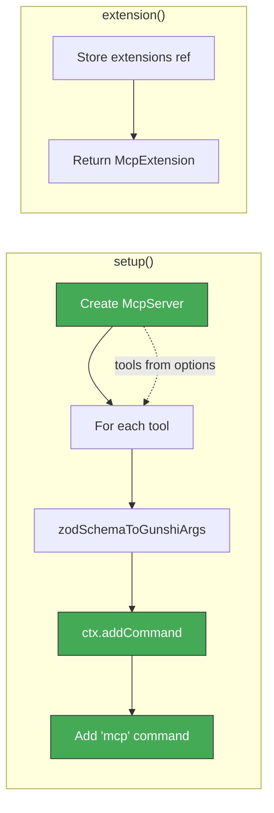
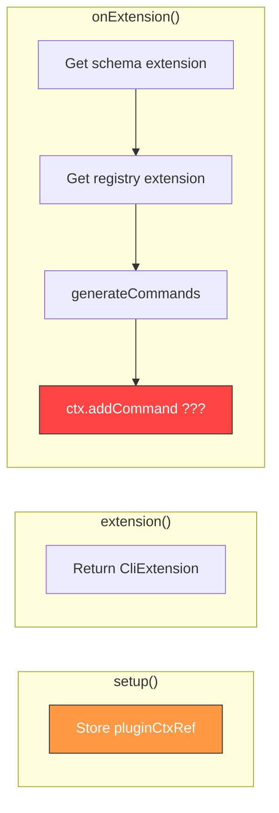
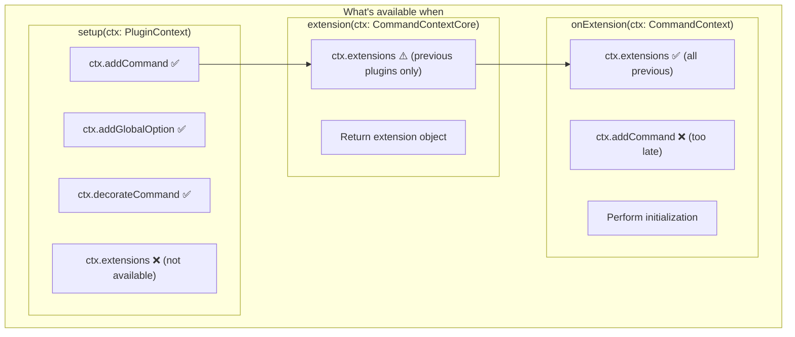

# Gunshi Plugin Lifecycle Deep Dive

This document provides a detailed analysis of the gunshi plugin lifecycle, how our plugins interact with it, and architectural recommendations.

## Gunshi Source References

All links reference commit `4b623da` from https://github.com/kazupon/gunshi:

- [cli/core.ts](https://github.com/kazupon/gunshi/blob/4b623da/packages/gunshi/src/cli/core.ts) - Main CLI execution
- [context.ts](https://github.com/kazupon/gunshi/blob/4b623da/packages/gunshi/src/context.ts) - CommandContext creation
- [plugin/core.ts](https://github.com/kazupon/gunshi/blob/4b623da/packages/gunshi/src/plugin/core.ts) - Plugin definition
- [plugin/context.ts](https://github.com/kazupon/gunshi/blob/4b623da/packages/gunshi/src/plugin/context.ts) - PluginContext API

---

## Lifecycle Overview



---

## Phase Details

### Phase 1: Plugin Setup (`applyPlugins`)

**Source**: [cli/core.ts#L116-L136](https://github.com/kazupon/gunshi/blob/4b623da/packages/gunshi/src/cli/core.ts#L116-L136)

```typescript
async function applyPlugins<G>(pluginContext, plugins): Promise<Plugin[]> {
  const sortedPlugins = resolveDependencies(plugins)  // Topological sort
  for (const plugin of sortedPlugins) {
    await plugin(pluginContext)  // Calls setup()
  }
  return sortedPlugins
}
```

During this phase:

- Plugins are sorted by dependencies
- Each plugin's `setup()` function is called with `PluginContext`
- **This is the ONLY time `addCommand()` and `addGlobalOption()` are effective**

**PluginContext API** ([plugin/context.ts#L39-L142](https://github.com/kazupon/gunshi/blob/4b623da/packages/gunshi/src/plugin/context.ts#L39-L142)):

| Method                          | Purpose                    |
| ------------------------------- | -------------------------- |
| `addGlobalOption(name, schema)` | Register global CLI option |
| `addCommand(name, command)`     | Register sub-command       |
| `hasCommand(name)`              | Check if command exists    |
| `decorateCommand(decorator)`    | Wrap command execution     |
| `decorateHeaderRenderer(...)`   | Customize help header      |
| `decorateUsageRenderer(...)`    | Customize usage output     |

### Phase 2: Command Resolution (`resolveCommandTree`)

**Source**: [cli/core.ts#L259-L413](https://github.com/kazupon/gunshi/blob/4b623da/packages/gunshi/src/cli/core.ts#L259-L413)

After plugins are set up, gunshi:

1. Parses argv tokens
2. Walks the command tree (entry → subcommands)
3. Resolves which command will run

**Critical insight**: Commands must be registered during Phase 1 to be discoverable here.

### Phase 3: Context Creation (`createCommandContext`)

**Source**: [context.ts#L126-L236](https://github.com/kazupon/gunshi/blob/4b623da/packages/gunshi/src/context.ts#L126-L236)

```typescript
async function createCommandContext({...}) {
  // Create core context
  const core = { name, description, values, positionals, ... }

  // Extend with plugin extensions
  for (const [key, extension] of Object.entries(extensions)) {
    ext[key] = await extension.factory(core, command)  // Create extension
    if (extension.onFactory) {
      await extension.onFactory(core, command)  // Post-creation hook
    }
  }

  return deepFreeze(core)
}
```

**Extension creation** ([context.ts#L222-L227](https://github.com/kazupon/gunshi/blob/4b623da/packages/gunshi/src/context.ts#L222-L227)):

- `extension.factory()` creates the extension object
- `extension.onFactory()` (aka `onExtension`) runs immediately after

At this point:

- All plugins' extensions are available via `ctx.extensions[pluginId]`
- Command tree is already resolved
- **Too late to add commands**

### Phase 4: Command Execution

**Source**: [cli/core.ts#L440-L481](https://github.com/kazupon/gunshi/blob/4b623da/packages/gunshi/src/cli/core.ts#L440-L481)

Decorators are applied in LIFO order, then `command.run(ctx)` executes.

---

## Plugin Hook Timing



**Key insight**: `setup()` runs before command resolution. `extension()` and `onExtension()` run after.

---

## Plugin Structure (from `plugin()`)

**Source**: [plugin/core.ts#L389-L447](https://github.com/kazupon/gunshi/blob/4b623da/packages/gunshi/src/plugin/core.ts#L389-L447)

```typescript
plugin({
  id: 'my-plugin',           // Unique identifier
  name: 'My Plugin',         // Human-readable name
  dependencies: ['other'],   // Plugin IDs this depends on

  setup: (ctx: PluginContext) => {
    // Phase 1: Called during applyPlugins()
    // - ctx.addCommand(), ctx.addGlobalOption()
    // - ctx.decorateCommand(), etc.
    // - NO access to other extensions yet
  },

  extension: (ctx: CommandContextCore, cmd: Command) => {
    // Phase 3: Creates the extension object
    // - ctx.extensions contains previous plugins' extensions
    // - Return value becomes ctx.extensions[id]
    return { myMethod: () => {} }
  },

  onExtension: (ctx: CommandContext, cmd: Command) => {
    // Phase 3: Called immediately after extension()
    // - All previous plugins' extensions available
    // - Can perform initialization that needs full context
    // - TOO LATE to add commands
  },
})
```

---

## Analysis: gunshi-mcp Plugins

### ✅ mcp-plugin.ts (Correct Pattern)

**File**: [src/mcp-plugin.ts](../../../src/mcp-plugin.ts)



**Why this works**:

- Tools are passed via `options.tools` (not from registry extension)
- Commands are added during `setup()` (Phase 1)
- No dependency on other plugin extensions during setup

```typescript
// mcp-plugin.ts#L60-L109
setup: async (ctx) => {
  server = new McpServer(...)

  const toolDefinitions = options.tools ?? []  // ✅ Tools from options

  for (const tool of toolDefinitions) {
    ctx.addCommand(tool.name, {...})  // ✅ During setup phase
  }

  ctx.addCommand("mcp", {...})  // ✅ During setup phase
},
```

### ⚠️ cli/plugin.ts (Problematic Pattern)

**File**: [src/cli/plugin.ts](../../../src/cli/plugin.ts)



**Problem**: Commands are generated in `onExtension()`, which runs **after** command resolution.

```typescript
// cli/plugin.ts#L48-L63
onExtension: (cmdCtx) => {
  const schemaExt = cmdCtx.extensions[SCHEMA_PLUGIN_ID]
  const registryExt = cmdCtx.extensions[REGISTRY_PLUGIN_ID]  // Need registry

  if (schemaExt && registryExt && pluginCtxRef) {
    registeredCommands = generateCommands({
      extensions: extensionsRef,
      options,
      addCommand: pluginCtxRef.addCommand.bind(pluginCtxRef),  // ⚠️ Too late!
    })
  }
},
```

**Why this is problematic**:

1. `registryExt.list()` returns tools, but only available in `onExtension()`
2. `addCommand()` during `onExtension()` adds to PluginContext's internal map
3. But `resolveCommandTree()` already ran in Phase 2
4. Commands exist but aren't discoverable on first run

---

## Recommendations

### Option A: Pass Tools Directly (Like mcp-plugin.ts)

```typescript
export interface CliPluginOptions {
  tools?: GunshiTool[]  // Pass tools at construction time
  // ...
}

export function createCliPlugin(options: CliPluginOptions = {}) {
  return plugin({
    id: CLI_PLUGIN_ID,
    dependencies: [SCHEMA_PLUGIN_ID],  // Only schema needed

    setup: (ctx) => {
      const { tools = [] } = options

      for (const tool of tools) {
        const args = generateArgsFromTool(tool, schemaHelpers)
        ctx.addCommand(tool.name, {
          name: tool.name,
          description: tool.description,
          args,
          run: createToolRunner(tool),
        })
      }
    },

    extension: () => ({
      get commands() { return options.tools?.map(t => t.name) ?? [] },
    }),
  })
}
```

### Option B: Synchronous Discovery Before Plugin

```typescript
// In user code:
const tools = await discoverTools({ patterns: ['tools/**/*.ts'] })

await cli(args, command, {
  plugins: [
    createRegistryPlugin({ tools }),
    createCliPlugin({ tools }),  // Pass same tools
    createServerPlugin({ tools }),
  ],
})
```

### Option C: Lazy Command Wrapper

Add a single entry command that lazily generates sub-commands:

```typescript
setup: (ctx) => {
  ctx.addCommand('tool', {
    name: 'tool',
    description: 'Run a tool',
    args: {
      name: { type: 'string', required: true, description: 'Tool name' },
    },
    run: async (cmdCtx) => {
      const registry = cmdCtx.extensions[REGISTRY_PLUGIN_ID]
      const tool = registry.get(cmdCtx.values.name)
      // Execute tool...
    },
  })
}
```

---

## Extension Access Timing



---

## Summary

| Hook            | When                        | Can Add Commands? | Has Extensions?  |
| --------------- | --------------------------- | ----------------- | ---------------- |
| `setup()`       | Phase 1 (before resolution) | ✅ Yes            | ❌ No            |
| `extension()`   | Phase 3 (after resolution)  | ❌ No             | ⚠️ Previous only |
| `onExtension()` | Phase 3 (after extension)   | ❌ No             | ✅ All previous  |

**Golden rule**: If a plugin needs to add commands, it must have all required data available during `setup()`. This means:

- Pass tools via options, not via registry extension
- Or ensure discovery happens synchronously before `cli()` is called
- Or use a lazy command pattern
