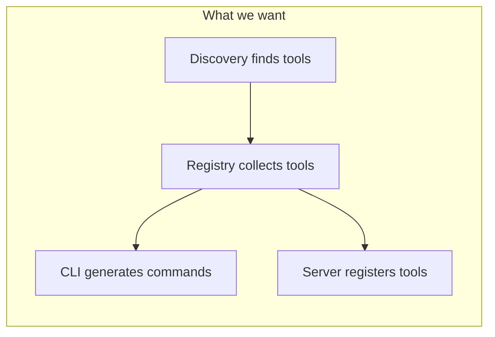
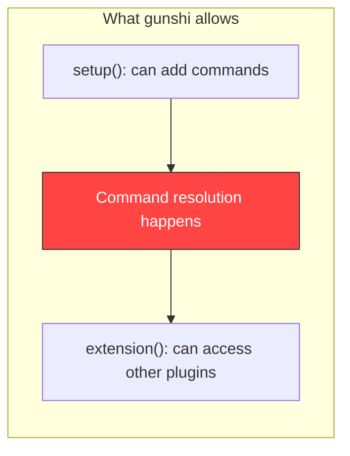
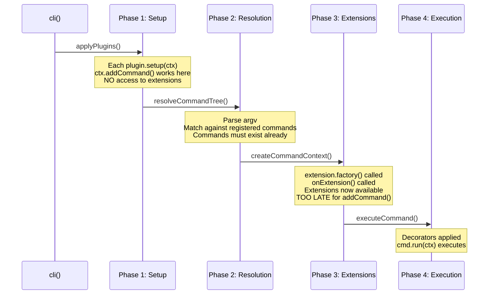
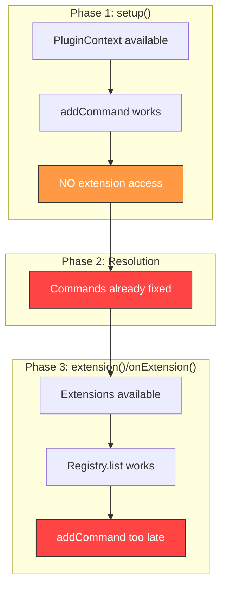
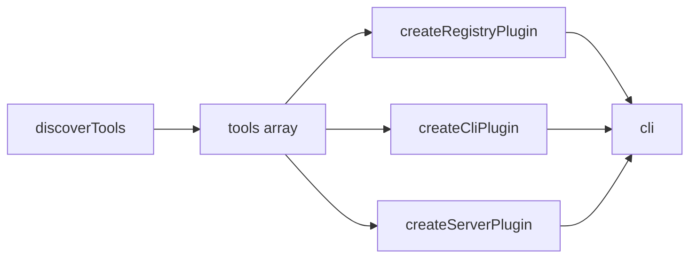
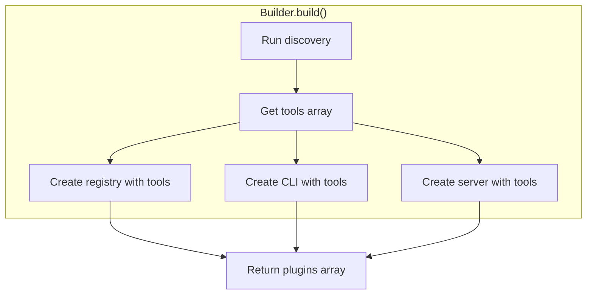

# Gunshi Lifecycle & Plugin Composition Challenge

This document analyzes how the gunshi plugin lifecycle interacts with our composable plugin architecture, identifies a fundamental timing problem, and explores solutions.

## Problem Statement

**PLAN-library.md envisions:**

```typescript
await cli(args, command, {
  plugins: [
    createDiscoveryPlugin({ patterns: ["tools/**/*.ts"] }),
    createRegistryPlugin({ autoDiscover: true }),
    createServerPlugin({ name: "my-app" }),
    createCliPlugin(),
  ],
})
```

The design assumes plugins can depend on each other's extensions:
- **Discovery** finds tools on the filesystem
- **Registry** collects tools (from discovery or explicit registration)
- **CLI Plugin** reads from registry and generates commands
- **Server Plugin** reads from registry and registers MCP tools
- **OpenCode Plugin** reads from registry and exposes tools

**The Problem**: Gunshi's lifecycle doesn't support this pattern. By the time a plugin can access another plugin's extension, it's too late to add commands.





---

## Gunshi Lifecycle Deep Dive

### Source References

All links reference the gunshi repository at https://github.com/kazupon/gunshi:

| File | Purpose |
|------|---------|
| [cli/core.ts](https://github.com/kazupon/gunshi/blob/main/packages/gunshi/src/cli/core.ts) | Main CLI execution |
| [context.ts](https://github.com/kazupon/gunshi/blob/main/packages/gunshi/src/context.ts) | CommandContext creation |
| [plugin/core.ts](https://github.com/kazupon/gunshi/blob/main/packages/gunshi/src/plugin/core.ts) | Plugin definition |
| [plugin/context.ts](https://github.com/kazupon/gunshi/blob/main/packages/gunshi/src/plugin/context.ts) | PluginContext API |

### The Four Phases



### Phase 1: Plugin Setup

**Source**: [cli/core.ts#L116-L136](https://github.com/kazupon/gunshi/blob/main/packages/gunshi/src/cli/core.ts#L116-L136)

```typescript
async function applyPlugins(pluginContext, plugins) {
  const sortedPlugins = resolveDependencies(plugins)
  for (const plugin of sortedPlugins) {
    await plugin(pluginContext)  // Calls setup()
  }
  return sortedPlugins
}
```

**PluginContext capabilities** ([plugin/context.ts#L39-L142](https://github.com/kazupon/gunshi/blob/main/packages/gunshi/src/plugin/context.ts#L39-L142)):

| Method | Available in setup()? |
|--------|----------------------|
| `addCommand(name, cmd)` | ✅ Yes |
| `addGlobalOption(name, schema)` | ✅ Yes |
| `decorateCommand(decorator)` | ✅ Yes |
| Access to other extensions | ❌ No |

### Phase 2: Command Resolution

**Source**: [cli/core.ts#L259-L413](https://github.com/kazupon/gunshi/blob/main/packages/gunshi/src/cli/core.ts#L259-L413)

Gunshi walks the command tree to find which command matches the user's input. **Commands must be registered during Phase 1** to be discoverable.

### Phase 3: Extension Creation

**Source**: [context.ts#L214-L228](https://github.com/kazupon/gunshi/blob/main/packages/gunshi/src/context.ts#L214-L228)

```typescript
for (const [key, extension] of Object.entries(extensions)) {
  ext[key] = await extension.factory(core, command)
  if (extension.onFactory) {
    await extension.onFactory(core, command)  // onExtension hook
  }
}
```

Extensions are created **after** command resolution. Calling `addCommand()` here adds to the internal map but the command won't be reachable.

### The Timing Mismatch



---

## Current Implementation Analysis

### CLI Plugin (src/cli/plugin.ts)

```typescript
export function createCliPlugin(options = {}) {
  return plugin({
    id: CLI_PLUGIN_ID,
    dependencies: [SCHEMA_PLUGIN_ID, REGISTRY_PLUGIN_ID],
    
    setup: (ctx) => {
      pluginCtxRef = ctx  // Store for later... but later is too late
    },
    
    onExtension: (cmdCtx) => {
      const registryExt = cmdCtx.extensions[REGISTRY_PLUGIN_ID]
      // Now we have registry, but...
      registeredCommands = generateCommands({
        addCommand: pluginCtxRef.addCommand,  // ⚠️ Too late!
      })
    },
  })
}
```

**Problem**: We need registry tools to generate commands, but registry extension isn't available until after command resolution.

### Server Plugin (src/server/plugin.ts)

```typescript
export function createServerPlugin(options = {}) {
  return plugin({
    setup: async (ctx) => {
      ctx.addCommand("mcp", {...})  // ✅ This works
    },
    
    extension: (ctx) => {
      if (options.autoRegister) {
        const registry = ctx.extensions[REGISTRY_PLUGIN_ID]
        // Register tools with MCP server - this works because
        // we're not adding commands, just registering MCP tools
      }
    },
  })
}
```

**This works** because registering MCP tools doesn't require `addCommand()`. The "mcp" command is static.

### Discovery Plugin (src/discovery/plugin.ts)

```typescript
export function createDiscoveryPlugin(options = {}) {
  return plugin({
    setup: async (ctx) => {
      discoveredTools = await runDiscovery()  // ✅ Runs during setup
      ctx.addCommand("tools", {...})  // ✅ Static command works
    },
  })
}
```

**This works** because discovery runs synchronously during setup. But other plugins can't access `discoveredTools` until Phase 3.

---

## Solution Space

### Option A: Pre-Discovery Pattern

Run discovery before calling `cli()`, pass results explicitly:

```typescript
// Discovery happens BEFORE gunshi
const tools = await discoverTools({ patterns: ["tools/**/*.ts"] })

await cli(args, command, {
  plugins: [
    createRegistryPlugin({ tools }),      // Tools passed directly
    createCliPlugin({ tools }),           // Tools passed directly
    createServerPlugin({ tools }),        // Tools passed directly
  ],
})
```



**Pros:**
- Simple, explicit
- Each plugin has tools during setup
- No lifecycle gymnastics

**Cons:**
- Breaks the "composable plugins" vision
- User must wire tools to each plugin manually
- Registry becomes redundant

### Option B: Builder Orchestration

The builder handles tool passing internally:

```typescript
const plugins = await gunshiMcp()
  .withDiscovery({ patterns: ["tools/**/*.ts"] })
  .withRegistry({ autoDiscover: true })
  .withCli()
  .withServer()
  .build()

await cli(args, command, { plugins })
```

Internally, `build()` does:

```typescript
async build() {
  // Run discovery first
  const tools = await discoverTools(this.config.discovery)
  
  // Pass tools to each plugin
  return [
    createRegistryPlugin({ tools }),
    createCliPlugin({ tools }),
    createServerPlugin({ tools }),
  ]
}
```



**Pros:**
- Maintains fluent API
- User doesn't see the wiring
- Plugins remain focused

**Cons:**
- Builder becomes load-bearing
- Discovery must be synchronous relative to plugin creation
- Registry plugin becomes a facade

### Option C: Lazy Command Pattern

Don't generate per-tool commands. Use a single dispatcher:

```typescript
setup: (ctx) => {
  ctx.addCommand("run", {
    name: "run",
    description: "Run a tool by name",
    args: {
      tool: { type: "string", required: true },
      // Generic args passed through
    },
    run: async (cmdCtx) => {
      const registry = cmdCtx.extensions[REGISTRY_PLUGIN_ID]
      const tool = registry.get(cmdCtx.values.tool)
      // Parse remaining args and execute
    },
  })
}
```

Usage: `mycli run fetch-data --url=...` instead of `mycli fetch-data --url=...`

**Pros:**
- Works with current lifecycle
- No timing issues
- Dynamic tool list

**Cons:**
- Worse UX (extra "run" subcommand)
- No per-tool help generation
- Feels like a workaround

### Option D: Two-Phase CLI

Run gunshi twice: first for discovery, second for execution:

```typescript
// Phase 1: Discovery run
const { tools } = await cli(args, discoveryCommand, {
  plugins: [createDiscoveryPlugin()],
})

// Phase 2: Full run with tools
await cli(args, mainCommand, {
  plugins: [
    createRegistryPlugin({ tools }),
    createCliPlugin({ tools }),
    createServerPlugin({ tools }),
  ],
})
```

**Pros:**
- Clean separation
- Each phase is simple

**Cons:**
- Startup overhead
- Complex to implement correctly
- Confusing mental model

### Option E: Gunshi Enhancement

Propose a new lifecycle hook to gunshi:

```typescript
plugin({
  // New hook: runs after all setup(), before resolution
  afterSetup: (ctx, allExtensions) => {
    const registry = allExtensions[REGISTRY_PLUGIN_ID]
    for (const tool of registry.list()) {
      ctx.addCommand(tool.name, {...})
    }
  },
})
```

**Pros:**
- Solves the problem properly
- Benefits other gunshi users

**Cons:**
- Requires upstream change
- Not available now

---

## Recommended Approach

**Option B (Builder Orchestration)** is the pragmatic choice:

1. The builder already exists
2. It can run discovery before creating plugins
3. Tools are passed explicitly to each plugin
4. User experience remains clean

```typescript
// User writes:
const plugins = await gunshiMcp()
  .withDiscovery({ patterns: ["tools/**/*.ts"] })
  .withCli()
  .withServer({ name: "my-app" })
  .build()

// Builder internally:
// 1. Runs discovery synchronously
// 2. Collects tools
// 3. Passes tools to CLI plugin options
// 4. Passes tools to Server plugin options
// 5. Returns configured plugins
```

This means:
- **CLI Plugin** accepts `tools` option, generates commands in `setup()`
- **Server Plugin** accepts `tools` option (already does via `options.tools`)
- **Registry Plugin** becomes optional (builder can skip if not explicitly requested)
- **Discovery Plugin** runs during `build()`, not as a gunshi plugin

### Implementation Changes Required

1. **Update CLI Plugin**: Add `tools` option, generate commands in `setup()`
2. **Update Builder**: Run discovery during `build()`, pass tools to plugins
3. **Update Server Plugin**: Already accepts `tools`, verify it works standalone
4. **Document**: The registry/discovery plugins are for advanced use cases

---

## Summary

| Approach | Complexity | UX Impact | Recommended? |
|----------|------------|-----------|--------------|
| A: Pre-Discovery | Low | Medium (manual wiring) | For simple cases |
| B: Builder Orchestration | Medium | None (hidden complexity) | ✅ Yes |
| C: Lazy Commands | Low | High (UX regression) | No |
| D: Two-Phase CLI | High | Low | No |
| E: Gunshi Enhancement | High | None | Future possibility |

The fundamental tension is between gunshi's lifecycle (extensions after commands) and our architecture (commands from extensions). **Option B** resolves this by moving discovery outside the gunshi lifecycle while keeping the user-facing API clean.
