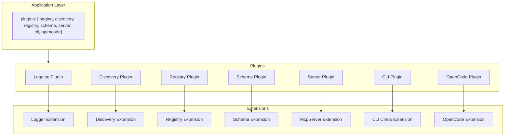
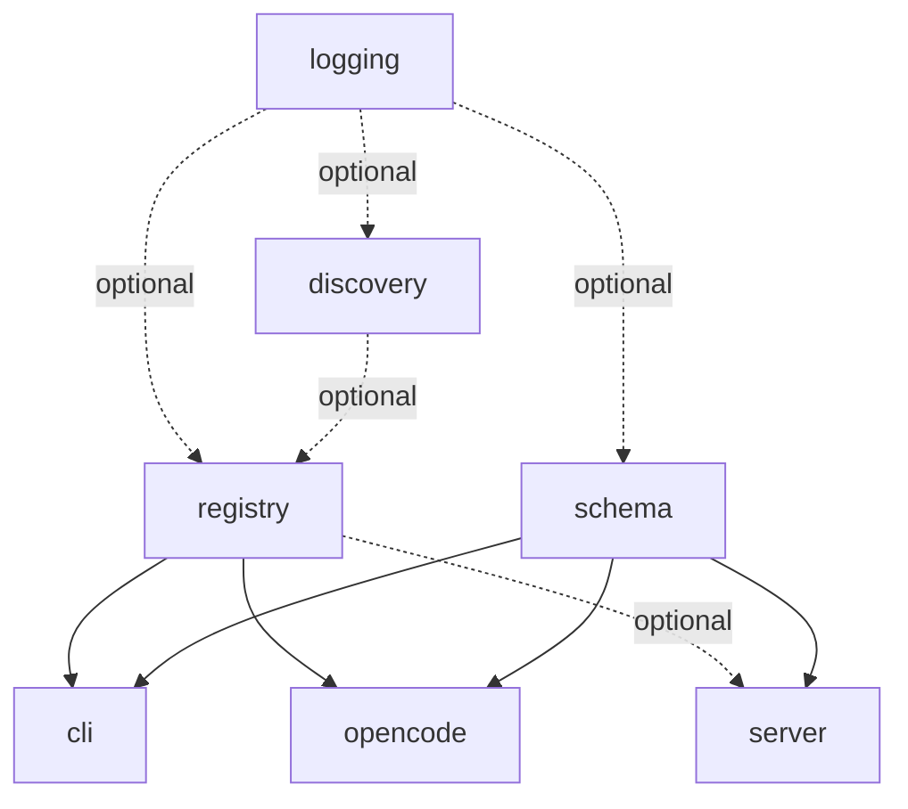

# gunshi-mcp Library Design

## Vision

Define a tool once with `defineTool()`, expose it everywhere - MCP server, CLI commands, OpenCode - via composable gunshi plugins.

gunshi-mcp is a toolkit for building tools. You're building a CLI application. Your application does things - it fetches data, transforms files, deploys infrastructure, manages resources. These capabilities are *tools*. gunshi-mcp helps you define these tools once and expose them through multiple interfaces: as CLI commands your users type, as MCP tools that AI assistants can invoke, as OpenCode custom tools for agentic workflows.

One definition. Multiple surfaces. No duplication.

### The Problem

Modern developer tools need to be accessible in multiple ways. A user might invoke your tool from their terminal. An AI coding assistant might invoke the same tool through MCP. An autonomous agent in OpenCode might need that same capability. Today, you'd write the same logic three times with three different APIs, three different schemas, three different ways of handling arguments and producing output.

### What gunshi-mcp Provides

gunshi-mcp is a library for people who are *making* tools - not using them. It's infrastructure for tool authors.

You describe your tool's purpose, its inputs (via Zod schemas), and its behavior (a handler function). gunshi-mcp takes that single definition and makes it available wherever it needs to be:

- **CLI**: Your tool becomes a command with flags, help text, and argument validation - all derived from your schema
- **MCP Server**: Your tool is exposed via the Model Context Protocol, ready for Claude, Cursor, or any MCP client
- **OpenCode**: Your tool integrates with opencode's custom tool system for agentic automation

The key insight is that these are all the same tool. The interface differs, but the capability is identical. gunshi-mcp bridges that gap.

### How It Works

gunshi-mcp builds on [gunshi](https://github.com/kazupon/gunshi), a modern CLI framework with a powerful plugin system. Each capability - discovery, registration, schema analysis, server management, CLI generation, OpenCode integration - is its own gunshi plugin with a focused responsibility.

You compose these plugins to match your needs:

```typescript
import { cli } from "gunshi"
import {
  createSchemaPlugin,
  createDiscoveryPlugin,
  createRegistryPlugin,
  createServerPlugin,
  createCliPlugin,
} from "gunshi-mcp"

await cli(args, command, {
  plugins: [
    createSchemaPlugin(),
    createDiscoveryPlugin({ patterns: ["tools/**/*.ts"] }),
    createRegistryPlugin({ autoDiscover: true }),
    createServerPlugin({ name: "my-app" }),
    createCliPlugin(),
  ],
})
```

Need MCP but not CLI? Omit the CLI plugin. Need CLI but not MCP? Omit the server plugin. The plugins are independent, composable building blocks.

---

## Plugin Architecture

gunshi-mcp decomposes into focused plugins, each with a single responsibility and a typed extension. Plugins can be used independently or combined.

### Plugin Inventory

```
┌───────────────────────────────────────────────────────────────────────────────────┐
│                             Application Layer                                  │
│   plugins: [logging, discovery, registry, schema, server, cli, opencode]   │
└───────────────────────────────────────────────────────────────────────────────────┘
                                         │
     ┌──────────┬──────────┬─────────────┼─────────────┬──────────┬──────────┐
     ▼          ▼          ▼             ▼             ▼          ▼          ▼
 ┌────────┐ ┌────────┐ ┌────────┐   ┌────────┐   ┌────────┐ ┌────────┐
 │Logging │ │Discovery│ │Registry│   │ Schema │   │ Server │ │  CLI   │ │OpenCode│
 │ Plugin │ │ Plugin │ │ Plugin │   │ Plugin │   │ Plugin │ │ Plugin │ │ Plugin │
 └────────┘ └────────┘ └────────┘   └────────┘   └────────┘ └────────┘
     │          │          │             │             │          │
     ▼          ▼          ▼             ▼             ▼          ▼
  Logger    Discovery   Registry     Schema       McpServer    CLI Cmds  OpenCode
Extension  Extension  Extension    Extension     Extension    Extension  Extension
```



### 1. Schema Plugin

**ID:** `gunshi-mcp:schema`

**Responsibility:** Shared Zod schema analysis infrastructure for other plugins. Introspects Zod schemas to extract field information, flattens nested schemas to flat keys with collision detection, caches analysis results, and provides extension points for custom type handlers.

**Factory:** `createSchemaPlugin(options?)`

**Extension:**
```typescript
export const SCHEMA_PLUGIN_ID = "gunshi-mcp:schema" as const

export interface SchemaExtension {
  /** Introspect a Zod schema, returning field information */
  introspect: <T extends z.ZodRawShape>(schema: z.ZodObject<T>) => ZodFieldInfo[]

  /** Flatten nested schema to flat keys with collision detection */
  flatten: <T extends z.ZodRawShape>(
    schema: z.ZodObject<T>,
    options?: FlattenOptions
  ) => FlattenedField[]

  /** Get cached analysis or compute fresh */
  analyze: <T extends z.ZodRawShape>(
    schema: z.ZodObject<T>,
    options?: AnalyzeOptions
  ) => SchemaAnalysis

  /** Register custom type handler for extension */
  registerTypeHandler: (typeName: string, handler: TypeHandler) => void
}

export interface SchemaAnalysis {
  fields: ZodFieldInfo[]
  flattened: FlattenedField[]
  required: string[]
  hasNested: boolean
  maxDepth: number
  warnings: SchemaWarning[]
  errors: SchemaError[]
  isValid: boolean
}
```

**Dependencies:** None (optional dependency on logging)

**Options:**
```typescript
interface SchemaPluginOptions {
  typeHandlers?: Record<string, TypeHandler>
  strict?: boolean
}
```

**Why a Schema Plugin?**

The core insight is that Zod schema analysis is *infrastructure*, not an implementation detail of any single plugin. When you define a tool with a Zod schema, multiple consumers need to understand that schema:

- **CLI** needs to flatten nested objects into flags, handle arrays, generate help text
- **MCP Server** can accept Zod schemas directly (via `@modelcontextprotocol/server`)
- **OpenCode** needs whatever schema format it requires (likely similar to MCP)

Rather than each plugin reimplementing Zod introspection, we create a **Schema Plugin** that:

1. Provides a `SchemaExtension` with methods to analyze Zod schemas
2. Exposes pipeline primitives: introspect, flatten, validate
3. Caches analysis results (a schema analyzed once doesn't need re-analysis)
4. Offers extension points for custom type handlers

Each consumer plugin then depends on the Schema Plugin and builds its own pipeline on top of the shared foundation.

**Pipeline Visualization:**

The pipeline becomes a first-class concept users can reason about:

```
Zod Schema
    ↓ [schema plugin: introspect]
ZodFieldInfo[]
    ↓ [schema plugin: flatten]
FlattenedField[]
    ↓ [cli plugin: toGunshiArgs]         ↓ [server plugin: pass-through]
GunshiArg[]                           Zod Schema (unchanged)
    ↓ [cli plugin: toCommand]            ↓ [server plugin: registerTool]
Gunshi Command                        MCP Tool
```

Note: The MCP server path is simpler because `@modelcontextprotocol/server` accepts Zod schemas directly. The schema plugin's introspect/flatten is primarily for CLI, but remains available for other consumers that need structured field information.

This makes the system understandable: there's a shared analysis phase, then consumer-specific output phases. Users who want to customize can intervene at any stage.

**Directory Structure:**
```
src/schema/
├── introspect/
│   ├── field.ts              # Extract ZodFieldInfo from a field
│   ├── unwrap.ts             # Unwrap optionals, defaults, etc.
│   ├── types.ts              # Introspection result types
│   └── index.ts
├── flatten/
│   ├── flatten.ts            # Nested schema → flat fields
│   ├── collision.ts          # Detect/report collisions
│   ├── types.ts              # FlattenContext, FlattenOptions
│   └── index.ts
├── validate/
│   ├── required.ts           # Validate required fields present
│   ├── types.ts              # Validate type compatibility
│   └── index.ts
├── cache.ts                  # Cache analyzed schemas
├── plugin.ts                 # createSchemaPlugin
├── types.ts                  # SchemaExtension, shared types
└── index.ts                  # Re-exports
```

**Status:** To be implemented

---

### 2. Logging Plugin

**ID:** `gunshi-mcp:logging`

**Responsibility:** Structured logging with level control

**Factory:** `createLoggingPlugin(options?)`

**Extension:**
```typescript
interface LoggerExtension {
  info: (msg: string, ...args: unknown[]) => void
  warn: (msg: string, ...args: unknown[]) => void
  error: (msg: string, ...args: unknown[]) => void
  debug: (msg: string, ...args: unknown[]) => void
  child: (bindings: Record<string, unknown>) => LoggerExtension
}
```

**Dependencies:** None

**Status:** Implemented in `src/plugins/logger.ts`

---

### 3. Discovery Plugin

**ID:** `gunshi-mcp:discovery`

**Responsibility:** Find and load GunshiTool definitions from filesystem

**Factory:** `createDiscoveryPlugin(options?)`

**Extension:**
```typescript
interface DiscoveryExtension {
  readonly tools: readonly GunshiTool[]
  rediscover: () => Promise<GunshiTool[]>
  hasTool: (name: string) => boolean
  getTool: (name: string) => GunshiTool | undefined
}
```

**Dependencies:** `logging` (optional)

**Options:**
```typescript
interface DiscoveryPluginOptions {
  roots?: RootDiscovery
  tools?: ToolDiscovery
  patterns?: string[]
  strict?: boolean
}
```

**CLI Commands Added:** `tools` - list discovered tools

---

### 4. Registry Plugin

**ID:** `gunshi-mcp:registry`

**Responsibility:** Manage tool collection with add/remove/list operations

**Factory:** `createRegistryPlugin(options?)`

**Extension:**
```typescript
interface RegistryExtension {
  register: (tool: GunshiTool) => void
  unregister: (name: string) => boolean
  list: () => readonly GunshiTool[]
  get: (name: string) => GunshiTool | undefined
  has: (name: string) => boolean
  clear: () => void
  readonly count: number
}
```

**Dependencies:** `discovery` (optional), `schema` (optional) - auto-registers discovered tools

**Options:**
```typescript
interface RegistryPluginOptions {
  tools?: GunshiTool[]
  autoDiscover?: boolean
  onConflict?: "replace" | "skip" | "error"
}
```

**Why separate from Discovery?**
- Registry manages the canonical tool collection
- Discovery is one source; explicit tools, remote registries are others
- Registry can exist without discovery (explicit tools only)
- Discovery can exist without registry (just find tools, don't manage)

---

### 5. Server Plugin

**ID:** `gunshi-mcp:server`

**Responsibility:** Create and manage McpServer lifecycle

**Factory:** `createServerPlugin(options?)`

**Extension:**
```typescript
interface ServerExtension {
  readonly server: McpServer
  readonly isRunning: boolean
  start: (transport?: Transport) => Promise<void>
  stop: () => Promise<void>
  registerTool: (tool: GunshiTool) => void
  registerPrompt: (prompt: McpPrompt) => void
  registerResource: (resource: McpResource) => void
}
```

**Dependencies:** `logging` (optional), `registry` (optional), `schema` (optional)

**Options:**
```typescript
interface ServerPluginOptions {
  name?: string
  version?: string
  capabilities?: Capabilities
  transport?: "stdio" | "sse" | Transport
  autoRegister?: boolean
}
```

**Key Insight:** The `@modelcontextprotocol/server` library accepts Zod schemas directly and handles conversion internally. The server plugin passes raw Zod schemas to `McpServer.registerTool()` - no JSON Schema conversion needed.

---

### 6. CLI Plugin

**ID:** `gunshi-mcp:cli`

**Responsibility:** Generate gunshi CLI commands from tools

**Factory:** `createCliPlugin(options?)`

**Extension:**
```typescript
interface CliExtension {
  readonly commands: readonly string[]
  refresh: () => void
}
```

**Dependencies:** `registry` (required), `schema` (required)

**Options:**
```typescript
interface CliPluginOptions {
  prefix?: string
  separator?: string
  formatFlag?: boolean
}
```

**Behavior:**
- During `setup`, reads tools from registry
- Calls `ctx.addCommand()` for each tool
- Uses schema plugin for Zod→GunshiArg conversion
- Calls `schemaExt.flatten()` with CLI-specific preferences (separator, maxDepth)

**Directory Structure:**
```
src/cli/
├── schema/                   # CLI-specific schema transforms
│   ├── to-gunshi-arg.ts      # ZodFieldInfo → GunshiArg
│   ├── arrays.ts             # Array handling strategies
│   ├── overrides.ts          # Apply user overrides
│   └── index.ts
├── values/
│   ├── reconstruct.ts        # Flat CLI values → nested object
│   ├── parse.ts              # Custom parsers
│   └── index.ts
├── commands.ts               # Generate commands from tools
├── plugin.ts                 # createCliPlugin (depends on schema)
└── index.ts
```

---

### 7. OpenCode Plugin

**ID:** `gunshi-mcp:opencode`

**Ticket:** gunshi-mcp-47k

**Responsibility:** Expose GunshiTools as opencode custom tools

**Factory:** `createOpenCodePlugin(options?)`

**Extension:**
```typescript
interface OpenCodeExtension {
  readonly isOpenCodeEnvironment: boolean
  readonly exposedTools: readonly string[]
  expose: (tool: GunshiTool) => void
}
```

**Dependencies:** `registry` (required), `schema` (optional)

**Options:**
```typescript
interface OpenCodePluginOptions {
  include?: string[]
  exclude?: string[]
  autoExpose?: boolean
}
```

**Open Question:** Detection of opencode environment
- Need a reliable way to detect we're running inside opencode
- Could be env var, process inspection, or opencode-provided API
- **Not solving now** - note as required capability from opencode

---

### Dependency Graph

```
                    ┌─────────┐
                    │ logging │
                    └────┬────┘
                         │ optional
             ┌────────────┼────────────┐
             ▼            ▼            ▼
       ┌──────────┐ ┌──────────┐ ┌──────────┐
       │ discovery│ │ registry │ │  schema  │
       └────┬─────┘ └────┬─────┘ └────┬─────┘
            │            │            │
            │  optional  │            │
            └─────►──────┤            │
                         │       ┌────┴────┐
            ┌────────────┤       │         │
            ▼            ▼       ▼         ▼
       ┌─────────┐  ┌─────────┐ ┌────┐ ┌────────┐
       │   cli   │  │opencode │ │svr │ │ server │
       └─────────┘  └─────────┘ └────┘ └────────┘
```



---

## The Builder

While each plugin has its own factory function, the **builder pattern** provides a convenient way to assemble multiple plugins together. It guides configuration with type safety and handles plugin ordering.

### Builder API

```typescript
import { gunshiMcp } from "gunshi-mcp"

const plugins = gunshiMcp()
  .withLogging({ level: "debug" })
  .withSchema({ typeHandlers: { "ZodBranded": handler } })
  .withDiscovery({ patterns: ["tools/**/*.ts"] })
  .withRegistry({ autoDiscover: true })
  .withServer({ name: "my-app" })
  .withCli()
  .withOpenCode()
  .build()

await cli(args, command, { plugins })
```

### Builder Methods

| Method | Plugin Created | Dependencies |
|--------|----------------|--------------|
| `.withLogging(opts?)` | `createLoggingPlugin` | None |
| `.withSchema(opts?)` | `createSchemaPlugin` | None |
| `.withDiscovery(opts?)` | `createDiscoveryPlugin` | Logging (optional), Schema (optional) |
| `.withRegistry(opts?)` | `createRegistryPlugin` | Discovery (optional), Schema (optional) |
| `.withServer(opts?)` | `createServerPlugin` | Registry (optional), Schema (optional) |
| `.withCli(opts?)` | `createCliPlugin` | Registry, Schema |
| `.withOpenCode(opts?)` | `createOpenCodePlugin` | Registry, Schema |
| `.build()` | Returns `Plugin[]` | - |

### Auto-Inclusion

The builder automatically includes the Schema Plugin when CLI, Server, or OpenCode plugins are added. This ensures the schema infrastructure is available without requiring explicit configuration:

```typescript
// Schema auto-included
gunshiMcp()
  .withCli()  // Automatically adds schema plugin
  .build()

// Explicit configuration
gunshiMcp()
  .withSchema({ typeHandlers: { ... } })
  .withCli()
  .build()
```

### Builder vs Direct Plugin Composition

The builder is syntactic sugar. These are equivalent:

```typescript
// Using builder
const plugins = gunshiMcp()
  .withDiscovery()
  .withRegistry({ autoDiscover: true })
  .withServer()
  .build()

// Using plugin factories directly
const plugins = [
  createDiscoveryPlugin(),
  createRegistryPlugin({ autoDiscover: true }),
  createServerPlugin(),
]
```

Use the builder for convenience. Use plugin factories directly when you need more control or are integrating with other gunshi plugins.

---

## Usage Patterns

### MCP Server Only (No CLI)

```typescript
const plugins = gunshiMcp()
  .withLogging()
  .withDiscovery()
  .withRegistry({ autoDiscover: true })
  .withServer({ name: "my-mcp", version: "1.0.0" })
  .build()
```

### CLI Only (No MCP Server)

```typescript
const plugins = gunshiMcp()
  .withDiscovery({ patterns: ["commands/**/*.ts"] })
  .withRegistry({ autoDiscover: true })
  .withCli({ prefix: "tool" })
  .build()
```

### OpenCode + MCP + CLI (Full Stack)

```typescript
const plugins = gunshiMcp()
  .withLogging({ level: "debug" })
  .withDiscovery()
  .withRegistry({ autoDiscover: true })
  .withServer()
  .withCli()
  .withOpenCode({ autoExpose: true })
  .build()
```

### Explicit Tools Only (No Discovery)

```typescript
import { myTool, otherTool } from "./tools/index.ts"

const plugins = gunshiMcp()
  .withRegistry({ tools: [myTool, otherTool] })
  .withServer()
  .withCli()
  .build()
```

### Custom Discovery Strategy

```typescript
import { chainRoots, defaultRootDiscovery, explicitRoots, globToolDiscovery } from "gunshi-mcp"

const plugins = gunshiMcp()
  .withDiscovery({
    roots: chainRoots(
      defaultRootDiscovery,
      explicitRoots("/shared/tools", "/plugins")
    ),
    tools: globToolDiscovery({
      patterns: ["**/*.tool.ts"],
      ignore: ["**/*.test.ts"],
    }),
  })
  .withRegistry({ autoDiscover: true })
  .withServer()
  .build()
```

### Programmatic Server Control

```typescript
// Using plugin factories for more control
const plugins = [
  createRegistryPlugin({ tools: myTools }),
  createServerPlugin({ autoRegister: false }),
]

const app = await cli(args, command, { plugins })

// Later, programmatically
const server = app.extensions["gunshi-mcp:server"]
server.registerTool(dynamicTool)
await server.start(new SseTransport())
```

---

## File Structure

Each plugin lives in its own directory. The directory contains both a **general-purpose implementation** (not gunshi-specific) and a **plugin wrapper** that composes it into gunshi's plugin system.

This separation means:
- The core logic can be used outside of gunshi
- The plugin is a thin adapter over proven, testable components
- Complex plugins can be broken into multiple files without cramming everything into one

```
src/
├── logging/
│   ├── logger.ts         # Pino logger factory, LoggerExtension interface
│   ├── plugin.ts         # createLoggingPlugin - wraps logger for gunshi
│   └── index.ts          # Re-exports
│
├── schema/
│   ├── introspect/
│   │   ├── field.ts      # Extract ZodFieldInfo from a field
│   │   ├── unwrap.ts     # Unwrap optionals, defaults, etc.
│   │   ├── types.ts      # Introspection result types
│   │   └── index.ts
│   ├── flatten/
│   │   ├── flatten.ts    # Nested schema → flat fields
│   │   ├── collision.ts  # Detect/report collisions
│   │   ├── types.ts      # FlattenContext, FlattenOptions
│   │   └── index.ts
│   ├── validate/
│   │   ├── required.ts   # Validate required fields present
│   │   ├── types.ts      # Validate type compatibility
│   │   └── index.ts
│   ├── cache.ts          # Cache analyzed schemas
│   ├── plugin.ts         # createSchemaPlugin
│   ├── types.ts          # SchemaExtension, shared types
│   └── index.ts          # Re-exports
│
├── discovery/
│   ├── roots.ts          # Root discovery strategies (async generators)
│   ├── tools.ts          # Tool discovery strategies (async generators)
│   ├── discover.ts       # discoverTools() - general-purpose discovery function
│   ├── types.ts          # RootDiscovery, ToolDiscovery types
│   ├── plugin.ts         # createDiscoveryPlugin - wraps discovery for gunshi
│   └── index.ts          # Re-exports
│
├── registry/
│   ├── registry.ts       # ToolRegistry class - add/remove/list tools
│   ├── plugin.ts         # createRegistryPlugin - wraps registry for gunshi
│   └── index.ts          # Re-exports
│
├── server/
│   ├── server.ts         # McpServer factory, transport handling
│   ├── tools.ts          # Tool registration helpers
│   ├── plugin.ts         # createServerPlugin - wraps server for gunshi
│   └── index.ts          # Re-exports
│
├── cli/
│   ├── schema/
│   │   ├── to-gunshi-arg.ts  # ZodFieldInfo → GunshiArg
│   │   ├── arrays.ts         # Array handling strategies
│   │   ├── overrides.ts      # Apply user overrides
│   │   └── index.ts
│   ├── values/
│   │   ├── reconstruct.ts    # Flat CLI values → nested object
│   │   ├── parse.ts          # Custom parsers
│   │   └── index.ts
│   ├── commands.ts       # Command generation from tools
│   ├── plugin.ts         # createCliPlugin (depends on schema)
│   └── index.ts
│
├── opencode/
│   ├── detection.ts      # Environment detection (TBD)
│   ├── exposure.ts       # Tool exposure to opencode
│   ├── plugin.ts         # createOpenCodePlugin - wraps for gunshi
│   └── index.ts
│
├── builder.ts            # gunshiMcp() builder
├── define-tool.ts        # defineTool() helper
├── types.ts              # GunshiTool, ToolContext, shared types
└── index.ts              # Main exports
```

**Goal:** Each `plugin.ts` should be a thin wrapper. The real work happens in sibling files that have no gunshi dependency. This makes the core logic reusable, testable in isolation, and easier to understand.

---

## Migration Strategy

1. **Phase 1:** Create `createSchemaPlugin` with introspect/flatten/validate/cache
2. **Phase 2:** Extract `createRegistryPlugin` from current mcp-plugin.ts
3. **Phase 3:** Extract `createServerPlugin` with transport configuration
4. **Phase 4:** Extract `createCliPlugin` with command generation (depends on schema)
5. **Phase 5:** Create `createDiscoveryPlugin` per PLAN-tool-discovery.md
6. **Phase 6:** Create `createOpenCodePlugin` per ticket 47k
7. **Phase 7:** Implement builder as composition layer
8. **Phase 8:** Update exports and documentation

---

## Benefits Summary

| Capability | With gunshi-mcp |
|------------|-----------------|
| Use MCP without CLI | ✅ `server` plugin only |
| Use CLI without MCP | ✅ `cli` + `registry` plugins |
| Use OpenCode without MCP | ✅ `opencode` + `registry` plugins |
| Custom tool sources | ✅ Replace `discovery` or use `registry` directly |
| Dynamic tool registration | ✅ `registry.register()` at runtime |
| Multiple transports | ✅ `server` plugin options |
| Shared schema infrastructure | ✅ `schema` plugin eliminates duplication |
| Custom type handlers | ✅ `schema` plugin extension points |
| Testability | ✅ Mock individual plugins |
| Tree-shaking | ✅ Import only what you need |

---

## Optional: Facade Plugin

A facade plugin (`createMcpPlugin`) that composes all other plugins with a single configuration object may be useful for quick-start scenarios:

```typescript
// Possible future convenience API
const plugins = [
  createMcpPlugin({
    name: "my-app",
    discovery: { patterns: ["tools/**/*.ts"] },
    server: { transport: "stdio" },
    cli: { formatFlag: true },
  })
]
```

This is optional and lower priority than the composable plugin architecture. The builder pattern serves a similar purpose with more flexibility.

---

## Appendix: Design Decision History

This appendix captures the exploration and analysis of various design options that led to the Schema Plugin architecture.

### CLI Structure Analysis

The existing `cli-args/` directory handles Zod-to-gunshi conversion with reasonable decomposition. The problems this design aimed to solve were:

1. **Naming is CLI-centric** - "cli-args" suggests this is only for CLI, but Zod introspection and flattening could serve MCP and OpenCode too
2. **Single monolithic pipeline** - The code flows introspect → flatten → build, but this isn't explicit. Users can't easily understand or customize the pipeline
3. **No shared schema foundation** - Each plugin (CLI, Server, OpenCode) will need to analyze Zod schemas. Currently there's no shared infrastructure
4. **Plugin structure unclear** - How does `cli/` relate to `cli-args/`? Where does the plugin wrapper live vs the schema logic?
5. **Extensibility** - If someone wants a different flattening strategy or custom array handling, the current structure doesn't make extension points obvious

### Alternative Approaches Considered

#### Option A: Keep cli-args as-is, nest under cli/

Move existing cli-args/ under cli plugin directory. Minimal change, already works. But `args/` name doesn't reflect that it's really "zod-to-gunshi", Zod introspection remains buried inside CLI (not reusable), and other plugins will duplicate introspection logic.

#### Option B: Rename to reflect pipeline stages

Model conversion as explicit pipeline stages with schema/, args/, values/ subdirectories. Better separation of concerns, clearer data flow. But still CLI-centric organization, and duplication if server/ needs same schema logic.

#### Option C: Separate zod-schema as top-level module

Make Zod introspection/flattening a shared module (`zod-schema/`). Reusable Zod utilities, cleaner plugin modules, clear shared foundation. But cross-module dependencies, generic naming, and no plugin for the shared schema logic.

#### Option D: Pipeline-as-transforms pattern

Model conversions as composable transforms (zod-to-field-info, flatten-fields, field-to-gunshi-arg, values-to-nested). Functional, composable, easy to test each transform. But might be too abstract, still CLI-only, and "transforms" is vague.

### Chosen Approach: Schema Plugin with Consumer-Specific Pipelines

The Schema Plugin approach combines insights from all alternatives:

1. **Schema as a first-class plugin** - A `schema` plugin provides shared Zod analysis infrastructure that other plugins depend on
2. **Explicit pipelines** - Each consumer (CLI, MCP, OpenCode) has a clear pipeline that transforms schema data to its output format
3. **Plugin-specific schema directories** - Each plugin can extend the shared schema infrastructure with consumer-specific logic
4. **Composable stages** - Pipeline stages are explicit, testable, and replaceable

This approach:
- Makes the pipeline concept explicit and user-facing
- Eliminates duplication of Zod analysis logic
- Follows gunshi's plugin architecture
- Provides clear extension points
- Balances shared infrastructure with consumer-specific needs

The main tradeoff is added complexity (one more plugin, more directories) in exchange for better separation of concerns and reusability.

### Key Design Decisions

#### Schema Plugin Granularity

**Question:** Should the schema plugin expose low-level primitives (introspect, flatten separately) or high-level analysis (one `analyze()` call)?

**Answer:** Both. Provide `analyze()` for common cases that returns a complete `SchemaAnalysis`, but also expose individual functions for users who want to customize the pipeline.

#### Caching Strategy

**Question:** How do we cache schema analysis? Key by schema reference? Schema shape hash?

**Answer:** Use a WeakMap keyed by schema reference for automatic garbage collection. For serialization scenarios, provide an optional string-based cache key.

```typescript
const schemaCache = new WeakMap<z.ZodObject<any>, SchemaAnalysis>()
```

#### Flatten Options Ownership

**Question:** Who owns flatten options (separator, maxDepth)? Schema plugin? CLI plugin?

**Answer:** Schema plugin owns the flatten operation and its options. CLI plugin passes its preferences when calling `flatten()`. This keeps the schema plugin general while allowing CLI-specific defaults.

```typescript
// CLI plugin calls schema plugin with its preferences
const flattened = schemaExt.flatten(tool.inputSchema, {
  separator: cliOptions.separator ?? "-",
  maxDepth: cliOptions.maxDepth ?? 3,
})
```

#### Type Handler Extension

**Question:** How do users register custom type handlers for exotic Zod types?

**Answer:** The schema plugin accepts handlers in its options and provides a runtime registration method:

```typescript
createSchemaPlugin({
  typeHandlers: {
    "ZodBranded": (schema) => ({ type: "string", ... }),
  },
})

// Or at runtime
schemaExt.registerTypeHandler("ZodBranded", handler)
```

#### JSON Schema Generation Location

**Question:** Does JSON Schema generation belong in schema/ or server/?

**Answer:** The `@modelcontextprotocol/server` library accepts Zod schemas directly (it handles conversion internally), so we prefer passing raw Zod schemas to MCP rather than converting ourselves. This means:

- **Server plugin does NOT need JSON Schema conversion** - pass Zod directly to McpServer
- **Schema plugin may still provide `toJsonSchema()`** for other consumers (documentation, OpenAPI, external validation)
- **Annotations stay in server/** - MCP-specific metadata like `annotations` field

This simplifies the server plugin significantly - it just passes the tool's `inputSchema` (Zod) directly to MCP.

#### Runtime Value Reconstruction

**Question:** Where does flat-to-nested value reconstruction live?

**Answer:** This is CLI-specific (reconstructing CLI flag values back to nested objects). It stays in `cli/values/reconstruct.ts`. The schema plugin doesn't deal with runtime values, only schema analysis.

#### Error Handling

**Question:** How do we handle schema analysis errors (unsupported types, collisions)?

**Answer:**
- Return errors in the analysis result rather than throwing
- Provide a `strict` mode that throws on first error
- Collisions return a warning by default, error in strict mode

```typescript
interface SchemaAnalysis {
  fields: ZodFieldInfo[]
  flattened: FlattenedField[]
  required: string[]
  hasNested: boolean
  maxDepth: number
  warnings: SchemaWarning[]
  errors: SchemaError[]
  isValid: boolean
}
```

#### Plugin vs Utility

**Question:** Does schema *need* to be a plugin, or could it just be utility functions?

**Answer:** Plugin provides benefits:
- Caching across command invocations
- Extension registration persists
- Other plugins can declare dependency
- Follows the established pattern

However, the underlying functions should be exported for use outside gunshi context. The plugin wraps them.

```typescript
// Direct utility use (no gunshi)
import { introspectSchema, flattenSchema } from "gunshi-mcp/schema"

// Plugin use (with gunshi)
const schemaExt = ctx.extensions["gunshi-mcp:schema"]
schemaExt.analyze(mySchema)
```

#### Builder Integration

**Question:** How does the builder handle the schema plugin?

**Answer:** Schema is auto-included when CLI, Server, or OpenCode are added. Users don't need to explicitly add it unless they want to configure it.

```typescript
gunshiMcp()
  .withCli()  // Automatically includes schema plugin
  .build()

// Explicit configuration
gunshiMcp()
  .withSchema({ typeHandlers: { ... } })
  .withCli()
  .build()
```

#### Naming: "Schema" vs Alternatives

**Question:** Is "schema" the right name? Alternatives: "zod", "types", "analysis"

**Answer:** "Schema" is correct because:
- It's the domain (schema analysis)
- It's not Zod-specific in concept (even if implementation uses Zod)
- "analysis" is a verb, "types" is too generic

Plugin ID: `gunshi-mcp:schema`
