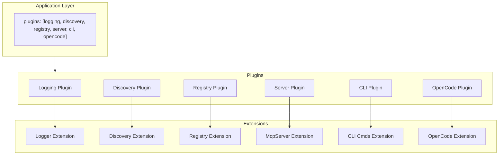
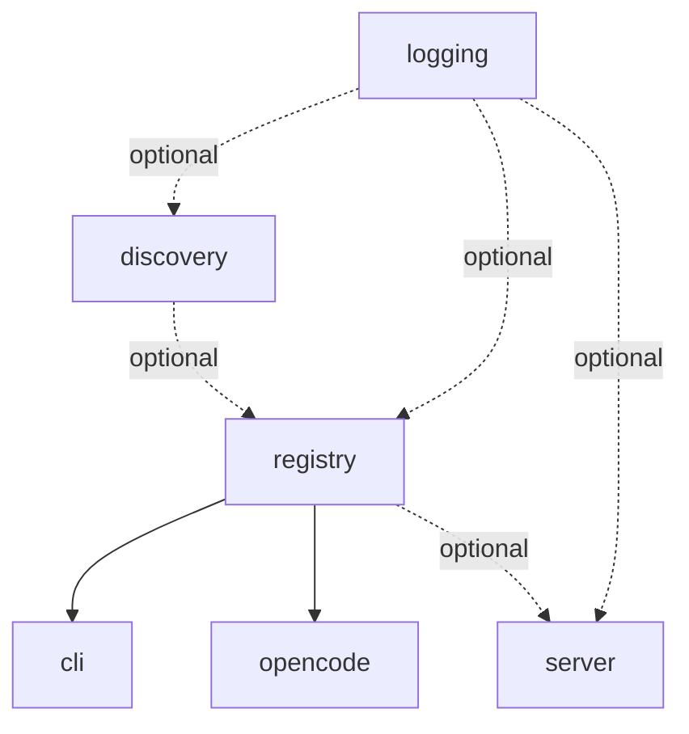

# gunshi-mcp Library Design

## Vision

Define a tool once with `defineTool()`, expose it everywhere - MCP server, CLI commands, OpenCode - via composable gunshi plugins.

gunshi-mcp is a toolkit for building tools. You're building a CLI application. Your application does things - it fetches data, transforms files, deploys infrastructure, manages resources. These capabilities are *tools*. gunshi-mcp helps you define these tools once and expose them through multiple interfaces: as CLI commands your users type, as MCP tools that AI assistants can invoke, as OpenCode custom tools for agentic workflows.

One definition. Multiple surfaces. No duplication.

### The Problem

Modern developer tools need to be accessible in multiple ways. A user might invoke your tool from their terminal. An AI coding assistant might invoke the same tool through MCP. An autonomous agent in OpenCode might need that same capability. Today, you'd write the same logic three times with three different APIs, three different schemas, three different ways of handling arguments and producing output.

### What gunshi-mcp Provides

gunshi-mcp is a library for people who are *making* tools - not using them. It's infrastructure for tool authors.

You describe your tool's purpose, its inputs (via Zod schemas), and its behavior (a handler function). gunshi-mcp takes that single definition and makes it available wherever it needs to be:

- **CLI**: Your tool becomes a command with flags, help text, and argument validation - all derived from your schema
- **MCP Server**: Your tool is exposed via the Model Context Protocol, ready for Claude, Cursor, or any MCP client
- **OpenCode**: Your tool integrates with opencode's custom tool system for agentic automation

The key insight is that these are all the same tool. The interface differs, but the capability is identical. gunshi-mcp bridges that gap.

### How It Works

gunshi-mcp builds on [gunshi](https://github.com/kazupon/gunshi), a modern CLI framework with a powerful plugin system. Each capability - discovery, registration, server management, CLI generation, OpenCode integration - is its own gunshi plugin with a focused responsibility.

You compose these plugins to match your needs:

```typescript
import { cli } from "gunshi"
import { 
  createDiscoveryPlugin,
  createRegistryPlugin,
  createServerPlugin,
  createCliPlugin 
} from "gunshi-mcp"

await cli(args, command, {
  plugins: [
    createDiscoveryPlugin({ patterns: ["tools/**/*.ts"] }),
    createRegistryPlugin({ autoDiscover: true }),
    createServerPlugin({ name: "my-app" }),
    createCliPlugin(),
  ],
})
```

Need MCP but not CLI? Omit the CLI plugin. Need CLI but not MCP? Omit the server plugin. The plugins are independent, composable building blocks.

---

## Plugin Architecture

gunshi-mcp decomposes into focused plugins, each with a single responsibility and a typed extension. Plugins can be used independently or combined.

### Plugin Inventory

```
┌───────────────────────────────────────────────────────────────────────────────┐
│                             Application Layer                                  │
│   plugins: [logging, discovery, registry, server, cli, opencode]              │
└───────────────────────────────────────────────────────────────────────────────┘
                                        │
    ┌──────────┬──────────┬─────────────┼─────────────┬──────────┬──────────┐
    ▼          ▼          ▼             ▼             ▼          ▼          ▼
┌────────┐ ┌────────┐ ┌────────┐   ┌────────┐   ┌────────┐ ┌────────┐
│Logging │ │Discovery│ │Registry│   │ Server │   │  CLI   │ │OpenCode│
│ Plugin │ │ Plugin │ │ Plugin │   │ Plugin │   │ Plugin │ │ Plugin │
└────────┘ └────────┘ └────────┘   └────────┘   └────────┘ └────────┘
    │          │          │             │             │          │
    ▼          ▼          ▼             ▼             ▼          ▼
 Logger    Discovery   Registry     McpServer     CLI Cmds  OpenCode
Extension  Extension  Extension    Extension     Extension  Extension
```



### 1. Logging Plugin

**ID:** `gunshi-mcp:logging`

**Responsibility:** Structured logging with level control

**Factory:** `createLoggingPlugin(options?)`

**Extension:**
```typescript
interface LoggerExtension {
  info: (msg: string, ...args: unknown[]) => void
  warn: (msg: string, ...args: unknown[]) => void
  error: (msg: string, ...args: unknown[]) => void
  debug: (msg: string, ...args: unknown[]) => void
  child: (bindings: Record<string, unknown>) => LoggerExtension
}
```

**Dependencies:** None

**Status:** Implemented in `src/plugins/logger.ts`

---

### 2. Discovery Plugin

**ID:** `gunshi-mcp:discovery`

**Responsibility:** Find and load GunshiTool definitions from filesystem

**Factory:** `createDiscoveryPlugin(options?)`

**Extension:**
```typescript
interface DiscoveryExtension {
  readonly tools: readonly GunshiTool[]
  rediscover: () => Promise<GunshiTool[]>
  hasTool: (name: string) => boolean
  getTool: (name: string) => GunshiTool | undefined
}
```

**Dependencies:** `logging` (optional)

**Options:**
```typescript
interface DiscoveryPluginOptions {
  roots?: RootDiscovery
  tools?: ToolDiscovery
  patterns?: string[]
  strict?: boolean
}
```

**CLI Commands Added:** `tools` - list discovered tools

---

### 3. Registry Plugin

**ID:** `gunshi-mcp:registry`

**Responsibility:** Manage tool collection with add/remove/list operations

**Factory:** `createRegistryPlugin(options?)`

**Extension:**
```typescript
interface RegistryExtension {
  register: (tool: GunshiTool) => void
  unregister: (name: string) => boolean
  list: () => readonly GunshiTool[]
  get: (name: string) => GunshiTool | undefined
  has: (name: string) => boolean
  clear: () => void
  readonly count: number
}
```

**Dependencies:** `discovery` (optional) - auto-registers discovered tools

**Options:**
```typescript
interface RegistryPluginOptions {
  tools?: GunshiTool[]
  autoDiscover?: boolean
  onConflict?: "replace" | "skip" | "error"
}
```

**Why separate from Discovery?**
- Registry manages the canonical tool collection
- Discovery is one source; explicit tools, remote registries are others
- Registry can exist without discovery (explicit tools only)
- Discovery can exist without registry (just find tools, don't manage)

---

### 4. Server Plugin

**ID:** `gunshi-mcp:server`

**Responsibility:** Create and manage McpServer lifecycle

**Factory:** `createServerPlugin(options?)`

**Extension:**
```typescript
interface ServerExtension {
  readonly server: McpServer
  readonly isRunning: boolean
  start: (transport?: Transport) => Promise<void>
  stop: () => Promise<void>
  registerTool: (tool: GunshiTool) => void
  registerPrompt: (prompt: McpPrompt) => void
  registerResource: (resource: McpResource) => void
}
```

**Dependencies:** `logging` (optional), `registry` (optional)

**Options:**
```typescript
interface ServerPluginOptions {
  name?: string
  version?: string
  capabilities?: Capabilities
  transport?: "stdio" | "sse" | Transport
  autoRegister?: boolean
}
```

---

### 5. CLI Plugin

**ID:** `gunshi-mcp:cli`

**Responsibility:** Generate gunshi CLI commands from tools

**Factory:** `createCliPlugin(options?)`

**Extension:**
```typescript
interface CliExtension {
  readonly commands: readonly string[]
  refresh: () => void
}
```

**Dependencies:** `registry`

**Options:**
```typescript
interface CliPluginOptions {
  prefix?: string
  separator?: string
  formatFlag?: boolean
}
```

**Behavior:**
- During `setup`, reads tools from registry
- Calls `ctx.addCommand()` for each tool
- Uses `zodSchemaToGunshiArgs` for arg conversion

---

### 6. OpenCode Plugin

**ID:** `gunshi-mcp:opencode`

**Ticket:** gunshi-mcp-47k

**Responsibility:** Expose GunshiTools as opencode custom tools

**Factory:** `createOpenCodePlugin(options?)`

**Extension:**
```typescript
interface OpenCodeExtension {
  readonly isOpenCodeEnvironment: boolean
  readonly exposedTools: readonly string[]
  expose: (tool: GunshiTool) => void
}
```

**Dependencies:** `registry`

**Options:**
```typescript
interface OpenCodePluginOptions {
  include?: string[]
  exclude?: string[]
  autoExpose?: boolean
}
```

**Open Question:** Detection of opencode environment
- Need a reliable way to detect we're running inside opencode
- Could be env var, process inspection, or opencode-provided API
- **Not solving now** - note as required capability from opencode

---

### Dependency Graph

```
                    ┌─────────┐
                    │ logging │
                    └────┬────┘
                         │ optional
            ┌────────────┼────────────┐
            ▼            ▼            ▼
      ┌──────────┐ ┌──────────┐ ┌──────────┐
      │ discovery│ │ registry │ │  server  │
      └────┬─────┘ └────┬─────┘ └────┬─────┘
           │            │            │
           │  optional  │            │
           └─────►──────┤            │
                        │            │
           ┌────────────┼────────────┐
           ▼            ▼            ▼
      ┌─────────┐  ┌─────────┐       │
      │   cli   │  │opencode │       │
      └─────────┘  └─────────┘       │
```



---

## The Builder

While each plugin has its own factory function, the **builder pattern** provides a convenient way to assemble multiple plugins together. It guides configuration with type safety and handles plugin ordering.

### Builder API

```typescript
import { gunshiMcp } from "gunshi-mcp"

const plugins = gunshiMcp()
  .withLogging({ level: "debug" })
  .withDiscovery({ patterns: ["tools/**/*.ts"] })
  .withRegistry({ autoDiscover: true })
  .withServer({ name: "my-app" })
  .withCli()
  .withOpenCode()
  .build()

await cli(args, command, { plugins })
```

### Builder Methods

| Method | Plugin Created | Dependencies |
|--------|----------------|--------------|
| `.withLogging(opts?)` | `createLoggingPlugin` | None |
| `.withDiscovery(opts?)` | `createDiscoveryPlugin` | Logging (optional) |
| `.withRegistry(opts?)` | `createRegistryPlugin` | Discovery (optional) |
| `.withServer(opts?)` | `createServerPlugin` | Registry (optional) |
| `.withCli(opts?)` | `createCliPlugin` | Registry |
| `.withOpenCode(opts?)` | `createOpenCodePlugin` | Registry |
| `.build()` | Returns `Plugin[]` | - |

### Builder vs Direct Plugin Composition

The builder is syntactic sugar. These are equivalent:

```typescript
// Using builder
const plugins = gunshiMcp()
  .withDiscovery()
  .withRegistry({ autoDiscover: true })
  .withServer()
  .build()

// Using plugin factories directly
const plugins = [
  createDiscoveryPlugin(),
  createRegistryPlugin({ autoDiscover: true }),
  createServerPlugin(),
]
```

Use the builder for convenience. Use plugin factories directly when you need more control or are integrating with other gunshi plugins.

---

## Usage Patterns

### MCP Server Only (No CLI)

```typescript
const plugins = gunshiMcp()
  .withLogging()
  .withDiscovery()
  .withRegistry({ autoDiscover: true })
  .withServer({ name: "my-mcp", version: "1.0.0" })
  .build()
```

### CLI Only (No MCP Server)

```typescript
const plugins = gunshiMcp()
  .withDiscovery({ patterns: ["commands/**/*.ts"] })
  .withRegistry({ autoDiscover: true })
  .withCli({ prefix: "tool" })
  .build()
```

### OpenCode + MCP + CLI (Full Stack)

```typescript
const plugins = gunshiMcp()
  .withLogging({ level: "debug" })
  .withDiscovery()
  .withRegistry({ autoDiscover: true })
  .withServer()
  .withCli()
  .withOpenCode({ autoExpose: true })
  .build()
```

### Explicit Tools Only (No Discovery)

```typescript
import { myTool, otherTool } from "./tools/index.ts"

const plugins = gunshiMcp()
  .withRegistry({ tools: [myTool, otherTool] })
  .withServer()
  .withCli()
  .build()
```

### Custom Discovery Strategy

```typescript
import { chainRoots, defaultRootDiscovery, explicitRoots, globToolDiscovery } from "gunshi-mcp"

const plugins = gunshiMcp()
  .withDiscovery({
    roots: chainRoots(
      defaultRootDiscovery,
      explicitRoots("/shared/tools", "/plugins")
    ),
    tools: globToolDiscovery({
      patterns: ["**/*.tool.ts"],
      ignore: ["**/*.test.ts"],
    }),
  })
  .withRegistry({ autoDiscover: true })
  .withServer()
  .build()
```

### Programmatic Server Control

```typescript
// Using plugin factories for more control
const plugins = [
  createRegistryPlugin({ tools: myTools }),
  createServerPlugin({ autoRegister: false }),
]

const app = await cli(args, command, { plugins })

// Later, programmatically
const server = app.extensions["gunshi-mcp:server"]
server.registerTool(dynamicTool)
await server.start(new SseTransport())
```

---

## File Structure

```
src/
├── plugins/
│   ├── logging.ts        # createLoggingPlugin
│   ├── discovery.ts      # createDiscoveryPlugin
│   ├── registry.ts       # createRegistryPlugin
│   ├── server.ts         # createServerPlugin
│   ├── cli.ts            # createCliPlugin
│   ├── opencode.ts       # createOpenCodePlugin
│   └── index.ts          # Re-exports all plugin factories
├── discovery/
│   ├── roots.ts          # Root discovery strategies
│   ├── tools.ts          # Tool discovery strategies
│   └── types.ts          # RootDiscovery, ToolDiscovery types
├── builder.ts            # gunshiMcp() builder
├── define-tool.ts        # defineTool() helper
├── types.ts              # GunshiTool, ToolContext, etc.
└── index.ts              # Main exports
```

---

## Migration Strategy

1. **Phase 1:** Extract `createRegistryPlugin` from current mcp-plugin.ts
2. **Phase 2:** Extract `createServerPlugin` with transport configuration
3. **Phase 3:** Extract `createCliPlugin` with command generation
4. **Phase 4:** Create `createDiscoveryPlugin` per PLAN-tool-discovery.md
5. **Phase 5:** Create `createOpenCodePlugin` per ticket 47k
6. **Phase 6:** Implement builder as composition layer
7. **Phase 7:** Update exports and documentation

---

## Benefits Summary

| Capability | With gunshi-mcp |
|------------|-----------------|
| Use MCP without CLI | ✅ `server` plugin only |
| Use CLI without MCP | ✅ `cli` + `registry` plugins |
| Use OpenCode without MCP | ✅ `opencode` + `registry` plugins |
| Custom tool sources | ✅ Replace `discovery` or use `registry` directly |
| Dynamic tool registration | ✅ `registry.register()` at runtime |
| Multiple transports | ✅ `server` plugin options |
| Testability | ✅ Mock individual plugins |
| Tree-shaking | ✅ Import only what you need |

---

## Optional: Facade Plugin

A facade plugin (`createMcpPlugin`) that composes all other plugins with a single configuration object may be useful for quick-start scenarios:

```typescript
// Possible future convenience API
const plugins = [
  createMcpPlugin({
    name: "my-app",
    discovery: { patterns: ["tools/**/*.ts"] },
    server: { transport: "stdio" },
    cli: { formatFlag: true },
  })
]
```

This is optional and lower priority than the composable plugin architecture. The builder pattern serves a similar purpose with more flexibility.
