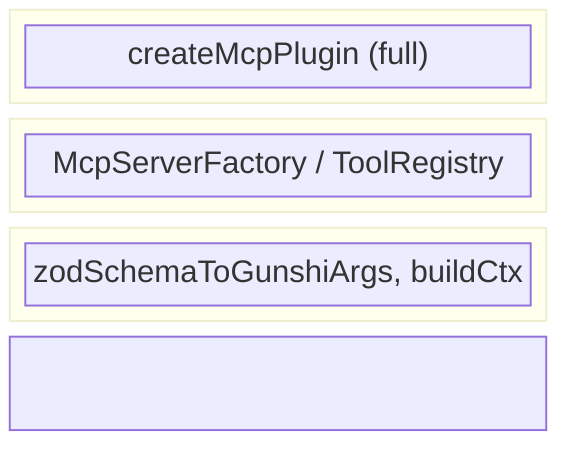
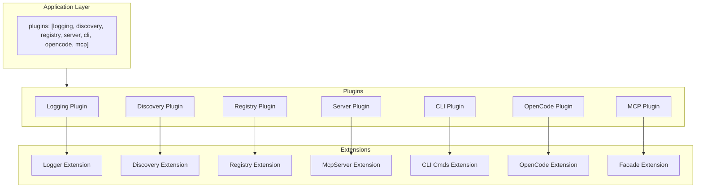
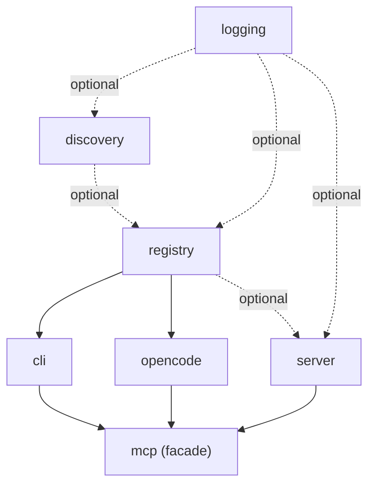

# Library Reusability Discovery

## Current State

gunshi-mcp currently exposes these modules for library consumers:

### Exported API (via `src/index.ts`)
- `createMcpPlugin` - main plugin factory (from mcp-plugin.ts)
- `defineTool` - type-safe tool definition helper
- `zodSchemaToGunshiArgs`, `reconstructNestedValues` - zod schema conversion
- `buildToolContext` - creates ToolContext for handlers
- `extractText`, `formatResult` - output utilities
- `createLoggingPlugin` - logging plugin factory
- Types: `ToolResult`, `ToolContext`, `GunshiTool`, `Tool`, `GunshiArg`, `McpExtension`, etc.

### What Works Well
1. **Tool definition is clean** - `defineTool<Extensions>()` provides good type inference
2. **Zod integration is solid** - schema-to-CLI conversion handles nested objects, arrays, enums
3. **Plugin architecture exists** - logging plugin shows the pattern for composable plugins
4. **Types are exported** - consumers can type their handlers properly

### Friction Points for Library Consumers

#### 1. Plugin is Opinionated About Application Structure
`createMcpPlugin` automatically adds the `mcp` command and wires tools to CLI commands. A library consumer who wants:
- Just the MCP server without CLI
- Just the CLI without MCP server
- Custom command names
- Different transport (SSE, HTTP)

...must work around the plugin's assumptions.

#### 2. Server Configuration is Hardcoded
```typescript
server = new McpServer({
  name: pluginName,
  version: pluginVersion,
}, {
  capabilities: { tools: {}, prompts: {} },
})
```
Consumers cannot:
- Provide custom capabilities
- Add resources, sampling
- Configure transport options
- Use their own McpServer instance

#### 3. Tool Registration is Coupled to Plugin Lifecycle
`registerTools()` requires the plugin to be initialized first. No way to:
- Register tools programmatically after setup
- Get a list of registered tools
- Dynamically add/remove tools

#### 4. Context Building is Minimal
`buildToolContext` creates a basic context with console-based logging. No integration with:
- The logging plugin (even though it exists)
- Request lifecycle hooks
- Middleware patterns

#### 5. Two Plugin Files Export Similar Things
- `plugin.ts` exports `createMcpPlugin` (default export)
- `mcp-plugin.ts` exports `createMcpPlugin` (named export)

Both have `McpExtension` interfaces. This is confusing.

#### 6. Example Uses Old Plugin
`examples/basic-usage.ts` imports from `plugin.ts` (the older, simpler one), not `mcp-plugin.ts`.

## Options for Improvement

### Option A: Layered API (Recommended)

Create distinct layers that can be used independently:

```
┌─────────────────────────────────────┐
│      createMcpPlugin (full)         │  ← High-level: tools + CLI + MCP
├─────────────────────────────────────┤
│   McpServerFactory / ToolRegistry   │  ← Mid-level: server/tools only
├─────────────────────────────────────┤
│  zodSchemaToGunshiArgs, buildCtx    │  ← Low-level: utilities
└─────────────────────────────────────┘
```



**New exports:**
- `createMcpServer(options)` - just creates and configures McpServer
- `ToolRegistry` - register/list/remove tools
- `createCliFromTools(tools)` - generates CLI commands from tools
- `createMcpPlugin(options)` - uses all of the above (current behavior)

**Benefits:**
- Consumers pick their abstraction level
- Existing code continues to work
- Testing individual layers is easier

### Option B: Configuration Over Convention

Keep single plugin but make everything configurable:

```typescript
createMcpPlugin({
  tools: [...],
  server: {
    name: "my-app",
    capabilities: { tools: {}, resources: {}, prompts: {} },
    transport: "sse" | "stdio" | customTransport,
  },
  cli: {
    enabled: true,
    commandPrefix: "",
    addMcpCommand: true,
  },
  context: {
    useLoggingPlugin: true,
    middleware: [...],
  },
})
```

**Benefits:**
- Single entry point
- Backwards compatible with defaults
- Discoverable via types

**Drawbacks:**
- Large options object
- Still tightly coupled internally

### Option C: Builder Pattern

```typescript
const mcp = mcpBuilder()
  .withTools(tools)
  .withServer({ name: "my-app" })
  .withTransport(new StdioServerTransport())
  .withLogging(createLoggingPlugin())
  .buildPlugin()
```

**Benefits:**
- Clear, fluent API
- Each method can validate/transform
- Good IDE completion

**Drawbacks:**
- More code to maintain
- Runtime overhead

### Option D: Separate Packages

Split into:
- `gunshi-mcp-core` - types, utilities, zod conversion
- `gunshi-mcp-server` - McpServer wrapper
- `gunshi-mcp-cli` - CLI integration
- `gunshi-mcp` - re-exports all, provides plugin

**Benefits:**
- Consumers only pay for what they use
- Clear separation of concerns
- Tree-shaking friendly

**Drawbacks:**
- Monorepo overhead
- Version coordination

## Recommended Path Forward

**Start with Option A (Layered API)** with these specific changes:

### Phase 1: Extract Core Components

1. **Create `src/server.ts`** - McpServer factory
   ```typescript
   export interface McpServerOptions {
     name: string
     version: string
     capabilities?: Capabilities
   }
   export function createServer(options: McpServerOptions): McpServer
   ```

2. **Create `src/registry.ts`** - Tool registration
   ```typescript
   export class ToolRegistry {
     register(tool: GunshiTool): void
     unregister(name: string): void
     list(): GunshiTool[]
     applyTo(server: McpServer): void
   }
   ```

3. **Consolidate plugins** - Remove `plugin.ts`, keep only `mcp-plugin.ts`

### Phase 2: Improve Plugin Configurability

4. **Add transport option** to `McpNewPluginOptions`
5. **Add `cli.enabled` option** to skip CLI command generation
6. **Connect logging plugin** to tool context

### Phase 3: Documentation

7. **Update example** to show layered usage
8. **Add library usage guide** in README
9. **Export map** in package.json for subpath imports:
   ```json
   "exports": {
     ".": "./gunshi-mcp.js",
     "./server": "./src/server.js",
     "./registry": "./src/registry.js",
     "./types": "./src/types.js"
   }
   ```

## Summary

| Aspect | Current | After Changes |
|--------|---------|---------------|
| Use as high-level plugin | ✅ Works | ✅ Works |
| Use just MCP server | ❌ Must use plugin | ✅ `createServer()` |
| Use just CLI from tools | ❌ Coupled to MCP | ✅ `createCliFromTools()` |
| Custom transport | ❌ Hardcoded stdio | ✅ Configurable |
| Tool registration | ❌ Setup-time only | ✅ ToolRegistry |
| Logging integration | ❌ Separate | ✅ Connected |
| Subpath imports | ❌ Single entry | ✅ Multiple entries |

The layered approach lets gunshi-mcp serve both quick-start users (use the plugin) and library authors (use individual components).

---

## Addendum: Composable Plugin Breakdown

Following gunshi's plugin architecture, gunshi-mcp can be decomposed into focused, composable plugins. Each plugin has a single responsibility, exposes a typed extension, and can be used independently or combined.

### Plugin Inventory

```
┌───────────────────────────────────────────────────────────────────────────────┐
│                             Application Layer                                  │
│   plugins: [logging, discovery, registry, server, cli, opencode, mcp]         │
└───────────────────────────────────────────────────────────────────────────────┘
                                        │
    ┌──────────┬──────────┬─────────────┼─────────────┬──────────┬──────────┐
    ▼          ▼          ▼             ▼             ▼          ▼          ▼
┌────────┐ ┌────────┐ ┌────────┐   ┌────────┐   ┌────────┐ ┌────────┐ ┌────────┐
│Logging │ │Discovery│ │Registry│   │ Server │   │  CLI   │ │OpenCode│ │  MCP   │
│ Plugin │ │ Plugin │ │ Plugin │   │ Plugin │   │ Plugin │ │ Plugin │ │ Plugin │
└────────┘ └────────┘ └────────┘   └────────┘   └────────┘ └────────┘ └────────┘
    │          │          │             │             │          │          │
    ▼          ▼          ▼             ▼             ▼          ▼          ▼
 Logger    Discovery   Registry     McpServer     CLI Cmds  OpenCode    Facade
Extension  Extension  Extension    Extension     Extension  Extension  Extension
```



### 1. Logging Plugin (exists)

**ID:** `gunshi-mcp:logging`

**Responsibility:** Structured logging with level control

**Extension:**
```typescript
interface LoggerExtension {
  info: (msg: string, ...args: unknown[]) => void
  warn: (msg: string, ...args: unknown[]) => void
  error: (msg: string, ...args: unknown[]) => void
  debug: (msg: string, ...args: unknown[]) => void
  child: (bindings: Record<string, unknown>) => LoggerExtension
}
```

**Dependencies:** None

**Status:** Already implemented in `src/plugins/logger.ts`

---

### 2. Discovery Plugin (new)

**ID:** `gunshi-mcp:discovery`

**Responsibility:** Find and load GunshiTool definitions from filesystem

**Extension:**
```typescript
interface DiscoveryExtension {
  readonly tools: readonly GunshiTool[]
  rediscover: () => Promise<GunshiTool[]>
  hasTool: (name: string) => boolean
  getTool: (name: string) => GunshiTool | undefined
}
```

**Dependencies:** `logging` (optional)

**Options:**
```typescript
interface DiscoveryPluginOptions {
  roots?: RootDiscovery
  tools?: ToolDiscovery
  patterns?: string[]
  strict?: boolean
}
```

**CLI Commands Added:** `tools` - list discovered tools

---

### 3. Registry Plugin (new)

**ID:** `gunshi-mcp:registry`

**Responsibility:** Manage tool collection with add/remove/list operations

**Extension:**
```typescript
interface RegistryExtension {
  register: (tool: GunshiTool) => void
  unregister: (name: string) => boolean
  list: () => readonly GunshiTool[]
  get: (name: string) => GunshiTool | undefined
  has: (name: string) => boolean
  clear: () => void
  readonly count: number
}
```

**Dependencies:** `discovery` (optional) - auto-registers discovered tools

**Options:**
```typescript
interface RegistryPluginOptions {
  /** Additional tools to register at startup */
  tools?: GunshiTool[]
  /** Auto-register from discovery plugin */
  autoDiscover?: boolean
  /** Behavior on name collision */
  onConflict?: "replace" | "skip" | "error"
}
```

**Why separate from Discovery?**
- Registry manages the canonical tool collection
- Discovery is one source; explicit tools, remote registries are others
- Registry can exist without discovery (explicit tools only)
- Discovery can exist without registry (just find tools, don't manage)

---

### 4. Server Plugin (new)

**ID:** `gunshi-mcp:server`

**Responsibility:** Create and manage McpServer lifecycle

**Extension:**
```typescript
interface ServerExtension {
  readonly server: McpServer
  readonly isRunning: boolean
  start: (transport?: Transport) => Promise<void>
  stop: () => Promise<void>
  registerTool: (tool: GunshiTool) => void
  registerPrompt: (prompt: McpPrompt) => void
  registerResource: (resource: McpResource) => void
}
```

**Dependencies:** `logging` (optional), `registry` (optional)

**Options:**
```typescript
interface ServerPluginOptions {
  name?: string
  version?: string
  capabilities?: Capabilities
  transport?: "stdio" | "sse" | Transport
  /** Auto-register tools from registry */
  autoRegister?: boolean
}
```

**Why separate from MCP plugin?**
- Server can run without CLI commands
- Consumers may want server control without the `mcp` command
- Enables programmatic server management

---

### 5. CLI Plugin (new)

**ID:** `gunshi-mcp:cli`

**Responsibility:** Generate gunshi CLI commands from tools

**Extension:**
```typescript
interface CliExtension {
  /** Commands generated from tools */
  readonly commands: readonly string[]
  /** Regenerate commands (after registry changes) */
  refresh: () => void
}
```

**Dependencies:** `registry`

**Options:**
```typescript
interface CliPluginOptions {
  /** Prefix for generated commands */
  prefix?: string
  /** Separator for nested args */
  separator?: string
  /** Add --format flag to commands */
  formatFlag?: boolean
}
```

**Behavior:**
- During `setup`, reads tools from registry
- Calls `ctx.addCommand()` for each tool
- Uses `zodSchemaToGunshiArgs` for arg conversion

**Why separate?**
- CLI generation is optional
- Some consumers want MCP server without CLI mirror
- Enables CLI-only usage (no MCP server)

---

### 6. OpenCode Plugin (new)

**ID:** `gunshi-mcp:opencode`

**Ticket:** gunshi-mcp-47k

**Responsibility:** Expose GunshiTools as opencode custom tools

**Extension:**
```typescript
interface OpenCodeExtension {
  /** Whether running inside opencode environment */
  readonly isOpenCodeEnvironment: boolean
  /** Tools exposed to opencode */
  readonly exposedTools: readonly string[]
  /** Manually trigger tool exposure (for dynamic registration) */
  expose: (tool: GunshiTool) => void
}
```

**Dependencies:** `registry`

**Options:**
```typescript
interface OpenCodePluginOptions {
  /** Only expose tools matching these names */
  include?: string[]
  /** Exclude tools matching these names */
  exclude?: string[]
  /** Auto-expose all registry tools */
  autoExpose?: boolean
}
```

**Behavior:**
- During `setup`, checks if running within opencode environment
- If in opencode, exposes registered tools via opencode's custom tool API
- Tools use same handler/schema as MCP - no additional boilerplate

**Open Question:** Detection of opencode environment
- Need a reliable way to detect we're running inside opencode
- Could be env var, process inspection, or opencode-provided API
- **Not solving now** - note as required capability from opencode

**Why separate plugin?**
- OpenCode integration is optional
- Can use MCP without opencode, or opencode without MCP server
- Keeps opencode-specific code isolated

---

### 7. MCP Plugin (facade)

**ID:** `gunshi-mcp:mcp`

**Responsibility:** High-level facade that composes other plugins

**Extension:**
```typescript
interface McpExtension {
  readonly discovery: DiscoveryExtension
  readonly registry: RegistryExtension
  readonly server: ServerExtension
  readonly cli: CliExtension
}
```

**Dependencies:** All of the above

**Options:**
```typescript
interface McpPluginOptions {
  name?: string
  version?: string
  tools?: GunshiTool[]
  discovery?: DiscoveryPluginOptions | false
  server?: ServerPluginOptions
  cli?: CliPluginOptions | false
}
```

**Behavior:**
- Instantiates and wires child plugins
- Adds `mcp` command that starts server with all registered tools
- Provides unified extension with access to all sub-extensions

---

### Dependency Graph

```
                    ┌─────────┐
                    │ logging │
                    └────┬────┘
                         │ optional
            ┌────────────┼────────────┐
            ▼            ▼            ▼
      ┌──────────┐ ┌──────────┐ ┌──────────┐
      │ discovery│ │ registry │ │  server  │
      └────┬─────┘ └────┬─────┘ └────┬─────┘
           │            │            │
           │  optional  │            │
           └─────►──────┤            │
                        │            │
           ┌────────────┼────────────┐
           ▼            ▼            ▼
      ┌─────────┐  ┌─────────┐       │
      │   cli   │  │opencode │       │
      └────┬────┘  └────┬────┘       │
           │            │            │
           └────────────┼────────────┘
                        ▼
                  ┌──────────┐
                  │   mcp    │
                  │ (facade) │
                  └──────────┘
```



### Usage Patterns

#### Full Stack (Current Behavior)
```typescript
await cli(args, command, {
  plugins: [createMcpPlugin()],
})
```

#### Discovery + CLI Only (No MCP Server)
```typescript
await cli(args, command, {
  plugins: [
    createLoggingPlugin(),
    createDiscoveryPlugin(),
    createRegistryPlugin({ autoDiscover: true }),
    createCliPlugin(),
  ],
})
```

#### MCP Server Only (No CLI Commands)
```typescript
await cli(args, command, {
  plugins: [
    createLoggingPlugin(),
    createRegistryPlugin({ tools: myTools }),
    createServerPlugin({ autoRegister: true }),
  ],
})
```

#### Explicit Tools, No Discovery
```typescript
await cli(args, command, {
  plugins: [
    createRegistryPlugin({ tools: [toolA, toolB] }),
    createServerPlugin({ autoRegister: true }),
    createCliPlugin(),
  ],
})
```

#### Programmatic Server Control
```typescript
const app = await cli(args, command, {
  plugins: [
    createRegistryPlugin({ tools: myTools }),
    createServerPlugin({ autoRegister: false }),
  ],
})

// Later, programmatically
const server = app.extensions["gunshi-mcp:server"]
server.registerTool(dynamicTool)
await server.start(new SseTransport())
```

### File Structure

```
src/
├── plugins/
│   ├── logging.ts        # LoggerExtension (exists)
│   ├── discovery.ts      # DiscoveryExtension
│   ├── registry.ts       # RegistryExtension
│   ├── server.ts         # ServerExtension
│   ├── cli.ts            # CliExtension
│   ├── opencode.ts       # OpenCodeExtension
│   └── index.ts          # Re-exports all plugins
├── discovery/
│   ├── roots.ts          # Root discovery strategies
│   ├── tools.ts          # Tool discovery strategies
│   └── types.ts          # RootDiscovery, ToolDiscovery types
├── mcp-plugin.ts         # Facade plugin (createMcpPlugin)
├── types.ts              # Shared types
└── index.ts              # Main exports
```

### Migration Strategy

1. **Phase 1:** Extract `RegistryPlugin` from current mcp-plugin.ts
2. **Phase 2:** Extract `ServerPlugin` with transport configuration
3. **Phase 3:** Extract `CliPlugin` with command generation
4. **Phase 4:** Create `DiscoveryPlugin` per PLAN-tool-discovery.md
5. **Phase 5:** Refactor `createMcpPlugin` as facade over child plugins
6. **Phase 6:** Update exports and documentation

### Benefits

| Aspect | Monolithic | Composable Plugins |
|--------|------------|-------------------|
| Use MCP without CLI | ❌ | ✅ `server` only |
| Use CLI without MCP | ❌ | ✅ `cli` + `registry` |
| Use OpenCode without MCP | ❌ | ✅ `opencode` + `registry` |
| Custom tool sources | ❌ | ✅ Replace `discovery` |
| Dynamic tool registration | ❌ | ✅ `registry.register()` |
| Multiple transports | ❌ | ✅ `server` options |
| Testability | Hard | Easy (mock each plugin) |
| Tree-shaking | Poor | Good (import what you need) |

### Considerations

**Plugin Order:** Gunshi resolves dependencies automatically, but explicit ordering in the plugins array can help readability.

**Circular Dependencies:** Avoided by making logging optional everywhere and having clear dependency direction (discovery → registry → cli/server → mcp).

**Extension Access:** Commands access extensions via `ctx.extensions[PLUGIN_ID]`. The facade's extension provides convenient access to all sub-extensions.

**Backwards Compatibility:** `createMcpPlugin()` with no arguments behaves exactly as today. New options enable composition.
